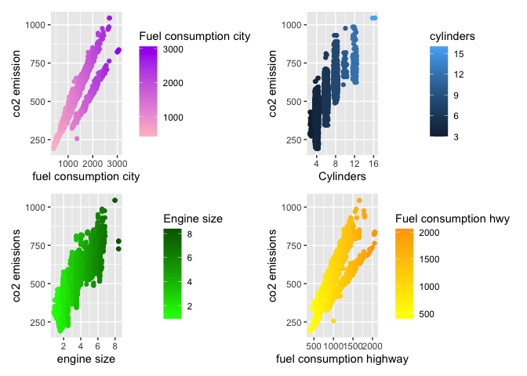
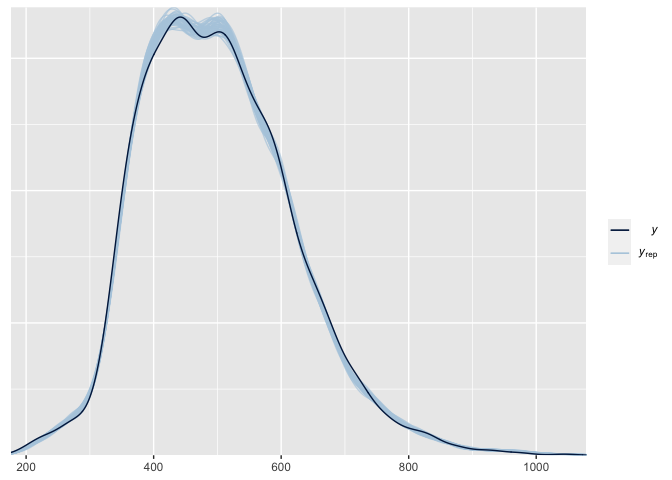
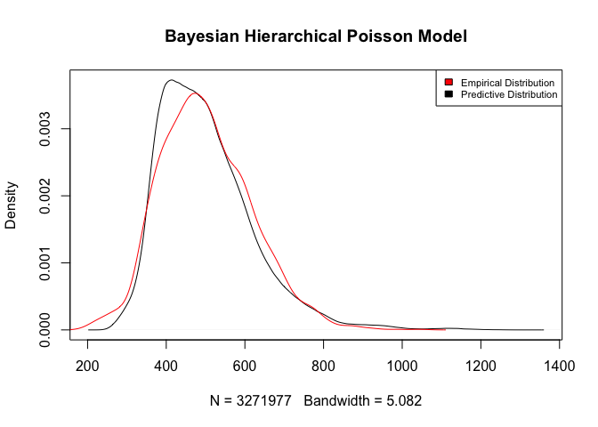

#### 1. IMPORT DATASET

This dataset captures the details of how CO2 emissions by a vehicle can vary with the different features. The dataset has been taken from Canada Government official open data website.This is a compiled version. This contains data over a period of 7 years. There are total 7385 rows and 12 columns.
The main attributes : 

- **make**: Company of the vehicle ( 42 groups)
- **model** : Car Model
- **vehicle_class**:  Class of Vehicle depending on their utility,capacity and weight
- **engine size** : Size of engine used in Litre
- **cylinders** : Number of cylinders
- **transmission** : Transmission type with number of gears
- **fuel type**: Type of Fuel used : (X=Regular gasoline,Z=Premium gasoline,Diesel,Ethanol,Natural Gas)
- **fuel_consumption_city_l_100_km**: City fuel consumption ratings are shown in litres per 100 kilometres 
- **fuel_consumption_hwy_l_100_km**: Highway fuel consumption ratings are shown in litres per 100 kilometres 
- **fuel_consumption_comb_l_100_km**: City fuel consumption ratings are shown in  miles per gallon
- **fuel_consumption_comb_mpg**: Highway fuel consumption ratings are shown in  miles per gallon
- **co2_emissions**: The tailpipe emissions of carbon dioxide (in grams per kilometre) for combined city and highway driving


```r
co2<-read_csv('/Users/gabrielecola/BayesianApproach_CO2/Data/CO2\ Emissions_Canada.csv')
glimpse(co2)
```

```
## Rows: 7,385
## Columns: 12
## $ Make                               <chr> "ACURA", "ACURA", "ACURA", "ACURA",…
## $ Model                              <chr> "ILX", "ILX", "ILX HYBRID", "MDX 4W…
## $ `Vehicle Class`                    <chr> "COMPACT", "COMPACT", "COMPACT", "S…
## $ `Engine Size(L)`                   <dbl> 2.0, 2.4, 1.5, 3.5, 3.5, 3.5, 3.5, …
## $ Cylinders                          <dbl> 4, 4, 4, 6, 6, 6, 6, 6, 6, 4, 4, 6,…
## $ Transmission                       <chr> "AS5", "M6", "AV7", "AS6", "AS6", "…
## $ `Fuel Type`                        <chr> "Z", "Z", "Z", "Z", "Z", "Z", "Z", …
## $ `Fuel Consumption City (L/100 km)` <dbl> 9.9, 11.2, 6.0, 12.7, 12.1, 11.9, 1…
## $ `Fuel Consumption Hwy (L/100 km)`  <dbl> 6.7, 7.7, 5.8, 9.1, 8.7, 7.7, 8.1, …
## $ `Fuel Consumption Comb (L/100 km)` <dbl> 8.5, 9.6, 5.9, 11.1, 10.6, 10.0, 10…
## $ `Fuel Consumption Comb (mpg)`      <dbl> 33, 29, 48, 25, 27, 28, 28, 25, 24,…
## $ `CO2 Emissions(g/km)`              <dbl> 196, 221, 136, 255, 244, 230, 232, …
```

#### 2. PRE-PROCESSING 
##### 2.1 CHECKING THE MISSING  VALUE

```r
sum(is.na(co2))
```

```
## [1] 0
```

##### 2.2 CLEANING THE NAME OF VARIABLE

```r
co2_emission<- co2 %>% clean_names(case='snake')
glimpse(co2_emission)
```

```
## Rows: 7,385
## Columns: 12
## $ make                           <chr> "ACURA", "ACURA", "ACURA", "ACURA", "AC…
## $ model                          <chr> "ILX", "ILX", "ILX HYBRID", "MDX 4WD", …
## $ vehicle_class                  <chr> "COMPACT", "COMPACT", "COMPACT", "SUV -…
## $ engine_size_l                  <dbl> 2.0, 2.4, 1.5, 3.5, 3.5, 3.5, 3.5, 3.7,…
## $ cylinders                      <dbl> 4, 4, 4, 6, 6, 6, 6, 6, 6, 4, 4, 6, 4, …
## $ transmission                   <chr> "AS5", "M6", "AV7", "AS6", "AS6", "AS6"…
## $ fuel_type                      <chr> "Z", "Z", "Z", "Z", "Z", "Z", "Z", "Z",…
## $ fuel_consumption_city_l_100_km <dbl> 9.9, 11.2, 6.0, 12.7, 12.1, 11.9, 11.8,…
## $ fuel_consumption_hwy_l_100_km  <dbl> 6.7, 7.7, 5.8, 9.1, 8.7, 7.7, 8.1, 9.0,…
## $ fuel_consumption_comb_l_100_km <dbl> 8.5, 9.6, 5.9, 11.1, 10.6, 10.0, 10.1, …
## $ fuel_consumption_comb_mpg      <dbl> 33, 29, 48, 25, 27, 28, 28, 25, 24, 31,…
## $ co2_emissions_g_km             <dbl> 196, 221, 136, 255, 244, 230, 232, 255,…
```

```r
summary(co2_emission)
```

```
##      make              model           vehicle_class      engine_size_l 
##  Length:7385        Length:7385        Length:7385        Min.   :0.90  
##  Class :character   Class :character   Class :character   1st Qu.:2.00  
##  Mode  :character   Mode  :character   Mode  :character   Median :3.00  
##                                                           Mean   :3.16  
##                                                           3rd Qu.:3.70  
##                                                           Max.   :8.40  
##    cylinders      transmission        fuel_type        
##  Min.   : 3.000   Length:7385        Length:7385       
##  1st Qu.: 4.000   Class :character   Class :character  
##  Median : 6.000   Mode  :character   Mode  :character  
##  Mean   : 5.615                                        
##  3rd Qu.: 6.000                                        
##  Max.   :16.000                                        
##  fuel_consumption_city_l_100_km fuel_consumption_hwy_l_100_km
##  Min.   : 4.20                  Min.   : 4.000               
##  1st Qu.:10.10                  1st Qu.: 7.500               
##  Median :12.10                  Median : 8.700               
##  Mean   :12.56                  Mean   : 9.042               
##  3rd Qu.:14.60                  3rd Qu.:10.200               
##  Max.   :30.60                  Max.   :20.600               
##  fuel_consumption_comb_l_100_km fuel_consumption_comb_mpg co2_emissions_g_km
##  Min.   : 4.10                  Min.   :11.00             Min.   : 96.0     
##  1st Qu.: 8.90                  1st Qu.:22.00             1st Qu.:208.0     
##  Median :10.60                  Median :27.00             Median :246.0     
##  Mean   :10.98                  Mean   :27.48             Mean   :250.6     
##  3rd Qu.:12.60                  3rd Qu.:32.00             3rd Qu.:288.0     
##  Max.   :26.10                  Max.   :69.00             Max.   :522.0
```

##### 2.2 SCALING VARIABLE

We transform **co2 emissions g km** ,**fuel consumption city l 100 km**,**fuel consumption hwy l 100 km**  in order to express them in the same scale ( 1 Litre for 1 kilometre)


```r
co2_emission <- co2_emission %>% 
  mutate(co2_emissions_g_km = 2 * co2_emissions_g_km) %>%
  mutate(fuel_consumption_city_l_100_km = 100 * fuel_consumption_city_l_100_km)%>%   
  mutate(fuel_consumption_hwy_l_100_km = 100 * fuel_consumption_hwy_l_100_km) %>%
  mutate(make = as.factor(co2_emission$make)) %>%
  mutate(fuel_type=as.factor(co2_emission$fuel_type))
```


#### 3. EDA
$HeatMap$ \
We use a heatmap to see clearly the correlation matrix: 


```r
co2_corr <- co2_emission %>%  select(-make,-model,-transmission,-vehicle_class,-fuel_type)
cor_matrix<-cor(co2_corr)
corrplot(cor_matrix, method="number",tl.cex=0.5,number.digits = 1)
```

<!-- -->

We can notice a high correlation between variables both positive and negative.
We also spot that our response variable **co2_emissions_g_km** is highly correlated with the other variable so
we pursue our analysis with a scatterplot in order to understand better the relationships.


$Scatterplot$ 


1. **Fuel_consumption_city** has positively  relationship with **Co2_emission**, if **Fuel_consumption_city** rise also **Co2_emission**.
2. **Cylinders** has positively  relationship with **Co2_emission**, if **Cylinders** rise also **Co2_emission**.
3. **Engine_size** has positively  relationship with **Co2_emission**, if **Engine_size** rise also **Co2_emission**.
4. **Fuel_consumption_highway** has positively  relationship with **Co2_emission**, if **Fuel_consumption_highway** rise also **Co2_ emission**.

```r
fuelcity_scatter<-ggplot(co2_emission, aes(x=fuel_consumption_city_l_100_km , y=co2_emissions_g_km )) +
  geom_jitter(aes(colour= fuel_consumption_city_l_100_km),width=0.5)+
  scale_color_gradient(name = "Fuel consumption city",low="pink", high='purple')+
  xlab('fuel consumption city')+
  ylab('co2 emission') 


cylinders_scatter<-ggplot(co2_emission, aes(x=cylinders,y=co2_emissions_g_km)) +
  geom_jitter(aes(colour = cylinders))+
  xlab('Cylinders')+
  ylab('co2 emission')

engine_scatter<-ggplot(co2_emission, aes(x=engine_size_l, y=co2_emissions_g_km)) +
  geom_jitter(aes(colour=engine_size_l))+
  scale_color_gradient(name = "Engine size ",low="green", high="darkgreen")+
  xlab('engine size')+
  ylab('co2 emissions')
  

fuelhw_scatter<-ggplot(co2_emission, aes(x=fuel_consumption_hwy_l_100_km, y=co2_emissions_g_km)) +
  geom_jitter(aes(colour=fuel_consumption_hwy_l_100_km))+
  scale_color_gradient(name = "Fuel consumption hwy",low="yellow", high="orange")+
  xlab('fuel consumption highway')+
  ylab('co2 emissions')
  
  

fuelcity_scatter+cylinders_scatter+ engine_scatter+fuelhw_scatter
```

<!-- -->


Here we create a Dataframe that reports the total count of emission for each vehicle class.

```r
data_emission<- co2_emission %>% group_by(vehicle_class) %>% distinct(vehicle_class,co2_emissions_g_km)%>% summarize(count=sum(co2_emissions_g_km))%>% arrange(desc(count))
head(data_emission)
```

In this two graph we want to analyze the variable **vehicle_class**, firstly with geom_bar so we look to the frequency of each **vehicle_ class**,and then with geom_col to see the overall emission for each **vehicle_class**.

```r
j<-ggplot() + geom_col(data =data_emission, aes(x = reorder(vehicle_class,count), y = count,fill=vehicle_class))+
  scale_fill_discrete(name = "vehicle class")+
  xlab('vehicle class')+
  ylab('Co2 emission')+
  coord_flip() +
  labs(title = "The total C02 emission")
  
  
# need to order the bar
m<-ggplot(data = co2_emission) +
  geom_bar(mapping = aes(x = vehicle_class ,fill=vehicle_class ))+
  scale_fill_discrete(name = "vehicle_class")+
  xlab('vehicle_class')+
  coord_flip() +
  labs(title = "Bar chart ")


m + theme(text = element_text(size = 5),plot.title=element_text(size = 9),axis.title.x=element_text(size = 8),axis.title.y=element_text(size = 8),legend.title=element_text(size = 7),legend.position = "none")  + j + theme(text = element_text(size = 5), plot.title=element_text(size = 9),axis.title.x=element_text(size = 8),axis.title.y=element_text(size = 8),legend.title=element_text(size = 7))
```

<!-- -->


Now our focus is on variable **Fuel_type**,so we decide to choose a boxplot for each **Fuel_type**.
We have observed that the highest median of emission is produced by Ethanol and followed by Premium Gasoline; and also
we spot that few Fuel type adopted Natural Gas.

Furthermore, we used a density plot to see how the Co2 emission density changed in base of Fuel type.
We spot the same pattern that we saw in box plot.

```r
boxplot<-ggplot(aes(x=fuel_type , y = co2_emissions_g_km  ),data=co2_emission)+
  geom_boxplot(aes(fill=fuel_type)) +
  theme_bw()+
  xlab('Fuel Type')+
  ylab('Co2 Emission')+
  scale_fill_discrete(name = "season")+
  labs(title = "Boxplot of Fuel Type ")


density_plot_fuel <- ggplot(co2_emission, aes(x =co2_emissions_g_km , fill =fuel_type )) + 
  geom_density(alpha = 0.5) +
  xlab('C02 Emission') +
  labs(title = "Density Plot ", caption = "D:Diesel, E:Ethanol, N:Natural Gas, X:Regular gasoline, Z:Premium gasoline")
  
  

boxplot+theme(plot.caption = element_text(size=5.5),legend.text = element_text(size=6)) + density_plot_fuel +
  theme(legend.text = element_text(size=6),plot.caption = element_text(size=8))
```

<!-- -->


Now our focus is on **Transmission**, through this plot we want to spot the C02 emission of each Transmission.
We can notice that the highest peaks of emission is produce by AM6 and in general the transmission that produce 
more C02 Emission is Automatic and Automatic with select shift

```r
c<-ggplot(data =co2_emission , aes(transmission,co2_emissions_g_km  )) +
  geom_line(color = "steelblue") +
  geom_point(color="steelblue") +
  xlab('Transmission')+
  ylab('Co2 Emission')+
    labs(title = "The C02 Emission for each Transmission ", caption = "A = Automatic, AM = Automated manual, AS = Automatic with select shift, AV = Continuously variable, M = Manual, 3 - 10 = Number of gears")
c + theme(text = element_text(size = 7),plot.caption = element_text(size=6.5),plot.title=element_text(size = 10),
          axis.title.x=element_text(size = 9),axis.title.y=element_text(size = 9))   
```

<!-- -->


Here we create a Dataframe that reports the total count of emission for each **car manufacturer**.

```r
data_emission_new<- co2_emission %>% group_by(make) %>% distinct(make,co2_emissions_g_km)%>% summarize(count=sum(co2_emissions_g_km))%>% arrange(desc(count))
```

The plot shows the total count of C02 Emission of each company, we can notice that 
Chevrolet, Ford ,Mercedes-Benz are the ones that produce the most C02 emission.

```r
a<-ggplot() + geom_col(data =data_emission_new, aes(x = reorder(make,count), y = count,fill=make))+
  scale_fill_discrete(name = "Make")+
  xlab('Make')+
  ylab('Co2 emission')+
  coord_flip()+
  labs(title = "The total Emission for each company")

a +  theme(legend.text = element_text(size=4),axis.text.y = element_text(size=7))
```

<!-- -->


We want to examine the distribution of our response variable **Y**

```r
ggplot(co2_emission, aes(x=co2_emissions_g_km)) + 
 geom_histogram(aes(y=..density..), colour="orange", fill="lightblue",bins=30)+
 geom_density(alpha=.2, fill="black") +
  geom_vline(aes(xintercept=mean(co2_emissions_g_km )),
            color="green", linetype="dashed", size=1)+
  labs(title = "The distribution of Y")+
  xlab('C02 Emission')
```

<!-- -->

Looking at the plot we can assume that our response could follow a Poisson distribution, but we know that for large count we can
approximate to a Normal Distribution. We start our analysis with a **Bayesian Linear Regression** and after we implement
a **Poisson Regression model**.
Finally we focus on the effect of different vehicle companies on C02 emission so we decide to fit an **Hierarchical Poisson Regression model**.

### 4. Feature Engineering

We remove **fuel_consumption_comb_l_100_km**,**fuel_consumption_comb_mpg** because have an high correlation with other variable such as :
**fuel_consumption_hwy_l_100_km**,**fuel_consumption_hwy_l_100_km**, that are the same variable but with different scale.
Furthermore we remove also some qualitative variable in order to avoid computational issues.


```r
new_emission<- co2_emission %>% select(-fuel_consumption_comb_l_100_km,-fuel_consumption_comb_mpg,-vehicle_class,-transmission,-model)
```


### 5. Model
We split the Datasets in Train ($70 \%$) and Test set ($30\%$)

```r
set.seed(123) 
sample <- sample.int(n = nrow(new_emission), size = floor(.70*nrow(new_emission)), replace = F)
train.emission <- new_emission[sample, ]
test.emission  <- new_emission[-sample, ]
```


##### 5.1 BAYESIAN LINEAR REGRESSION (1 APPROACH)


Our **Model** is:

$$Y=\beta_{0}+\beta_{1}x_{1}+...\beta_{p}x_{p}+ \epsilon \\ with\ p=50 \ and\ \epsilon \sim \ \mathcal{N}(0,1)$$  
with the sampling model:
$$Y_{i
}\sim \mathcal{N}(Y_{i}|\beta^{T}x_{i},\sigma)$$


with the default prior:

$$\beta_{0}^{(0)}\sim \mathcal{N}(\beta_{0}|501,(2.5)) \\ \beta_{j}^{(0)}\sim \mathcal{N}(\beta_{j}|0,(2.5)) \\ \sigma^{(0)}\sim Exp(1) $$
for the Intercept, Stan specify a mean such that correspond to sample mean of  response variable in this cases is equal to 500.


Where our p predictors are: **Intercept**, **engine_size_l**, **cylinders**, **fuel_consumption_city_l_100_km**, **fuel_consumption_hwy_l_100_km**,
**fuel_type**, **make**  


```r
stan_model <- stan_glm (co2_emissions_g_km  ~ engine_size_l + cylinders+ fuel_consumption_city_l_100_km+fuel_consumption_hwy_l_100_km+fuel_type+make,
chains=4,
iter=3000,
warmup=500 ,
thin=3,
data=train.emission)
```

$Brief \ Summary$ 

**Intercept**: For the intercept, the default prior is normal with a standard deviation 2.5, but in this case the standard deviation was adjusted to 294. There is also a note in parentheses informing you that the prior applies to the intercept after all predictors have been centered , this because placing a prior on the intercept after centering the predictors typically makes it easier to specify a reasonable prior for the intercept. 

**Coefficients**: By default the regression coefficients are treated as a priori independent with normal priors centered at 0 and with scale (standard deviation) 2.5.\
rstanarm by default set a weakly informative prior that will be adjusted by the scales of the priors on the coefficients. \

**Auxiliary** : sigma, the error standard deviation, has a default prior that is exponential(1)
However, as a result of the automatic rescaling, the actual scale used was 0.0085.
Furthermore,the default prior on the auxiliary parameter is an exponential distribution with rate ($\frac{1}{\sigma_{y}})$


**Note on data-based priors** 
Because the scaling is based on the scales of the predictors (and possibly the outcome) these are technically data-dependent priors. However, since these priors are quite wide (and in most cases rather conservative), the amount of information used is weak and mainly takes into account the order of magnitude of the variables. This enables rstanarm to offer defaults that are reasonable for many models.


```r
priors <- prior_summary(stan_model)
priors
```

```
## Priors for model 'stan_model' 
## ------
## Intercept (after predictors centered)
##   Specified prior:
##     ~ normal(location = 501, scale = 2.5)
##   Adjusted prior:
##     ~ normal(location = 501, scale = 294)
## 
## Coefficients
##   Specified prior:
##     ~ normal(location = [0,0,0,...], scale = [2.5,2.5,2.5,...])
##   Adjusted prior:
##     ~ normal(location = [0,0,0,...], scale = [216.08,160.66,  0.84,...])
## 
## Auxiliary (sigma)
##   Specified prior:
##     ~ exponential(rate = 1)
##   Adjusted prior:
##     ~ exponential(rate = 0.0085)
## ------
## See help('prior_summary.stanreg') for more details
```


##### TABLE OF COEFFICIENT PRIOR 


```r
Distribution<- rep(c('Normal'),each=50)
mean_prior<- c(priors$prior_intercept$location,priors$prior$location)
sd_prior<- c(priors$prior_intercept$adjusted_scale,priors$prior$adjusted_scale)


c <- c(Distribution,round(mean_prior,2),round(sd_prior,2))
res <- matrix(c, ncol = 3, byrow = F)
colnames(res) <- c('Distribution','mean','sd')
row.names(res) <- c( 'Intercept','engine_size_l', 'cylinders', 'fuel_consumption_city_l_100_km', 'fuel_consumption_hwy_l_100_km','fuel_typeE','fuel_typeN','fuel_typeX','fuel_typeZ','makeALFA ROMEO','makeASTON MARTIN',
                    'makeAUDI','makeBENTLEY','makeBMW','makeBUGATTI','makeBUICK','makeCADILLAC','makeCHEVROLET','makeCHRYSLER','makeDODGE','makeFIAT','makeFORD','makeGENESIS','makeGMC','makeHONDA','makeHYUNDAI','makeINFINITI','makeJAGUAR','makeJEEP',
                    'makeKIA','makeLAMBORGHINI','makeLAND ROVER','makeLEXUS','makeLINCOLN','makeMASERATI','makeMAZDA','makeMERCEDES-BENZ','makeMINI','makeMITSUBISHI','makeNISSAN',
                    'makePORSCHE','makeRAM','makeROLLS-ROYCE','makeSCION','makeSMART','makeSRT','makeSUBARU','makeTOYOTA',
                    'makeVOLKSWAGEN','makeVOLVO'
                    )
as.table(res)
```

```
##                                Distribution mean   sd      
## Intercept                      Normal       501.13 294.23  
## engine_size_l                  Normal       0      216.08  
## cylinders                      Normal       0      160.66  
## fuel_consumption_city_l_100_km Normal       0      0.84    
## fuel_consumption_hwy_l_100_km  Normal       0      1.32    
## fuel_typeE                     Normal       0      1348.55 
## fuel_typeN                     Normal       0      21154.12
## fuel_typeX                     Normal       0      588.56  
## fuel_typeZ                     Normal       0      593.02  
## makeALFA ROMEO                 Normal       0      4420.36 
## makeASTON MARTIN               Normal       0      3587.52 
## makeAUDI                       Normal       0      1555.69 
## makeBENTLEY                    Normal       0      3938.91 
## makeBMW                        Normal       0      1151.36 
## makeBUGATTI                    Normal       0      14959.67
## makeBUICK                      Normal       0      2398.19 
## makeCADILLAC                   Normal       0      2157.23 
## makeCHEVROLET                  Normal       0      1071    
## makeCHRYSLER                   Normal       0      2948.13 
## makeDODGE                      Normal       0      1640.35 
## makeFIAT                       Normal       0      2893.59 
## makeFORD                       Normal       0      1058.63 
## makeGENESIS                    Normal       0      4994.29 
## makeGMC                        Normal       0      1451.14 
## makeHONDA                      Normal       0      1764.13 
## makeHYUNDAI                    Normal       0      1764.13 
## makeINFINITI                   Normal       0      2460.35 
## makeJAGUAR                     Normal       0      2066.35 
## makeJEEP                       Normal       0      1631.22 
## makeKIA                        Normal       0      1663.9  
## makeLAMBORGHINI                Normal       0      3810.47 
## makeLAND ROVER                 Normal       0      2681.3  
## makeLEXUS                      Normal       0      1922.71 
## makeLINCOLN                    Normal       0      2681.3  
## makeMASERATI                   Normal       0      3166.98 
## makeMAZDA                      Normal       0      1871.94 
## makeMERCEDES-BENZ              Normal       0      1229.85 
## makeMINI                       Normal       0      1769.94 
## makeMITSUBISHI                 Normal       0      2620.42 
## makeNISSAN                     Normal       0      1622.25 
## makePORSCHE                    Normal       0      1346.09 
## makeRAM                        Normal       0      2476.67 
## makeROLLS-ROYCE                Normal       0      3489.89 
## makeSCION                      Normal       0      6113.18 
## makeSMART                      Normal       0      10580.13
## makeSRT                        Normal       0      21154.12
## makeSUBARU                     Normal       0      2085.52 
## makeTOYOTA                     Normal       0      1418.05 
## makeVOLKSWAGEN                 Normal       0      1907.77 
## makeVOLVO                      Normal       0      2261.67
```

**Median**: regardless of the estimation algorithm, point estimates are medians computed from simulations.The simulations are generated from the asymptotic Gaussian sampling distribution of the parameters.

**MAD_SD**: The standard deviations reported (labeled MAD_SD in the print output) are computed from the same set of draws described above. Compared to the raw posterior standard deviation, the MAD_SD will be more robust for long-tailed distributions. 


```r
stan_model
```

```
## stan_glm
##  family:       gaussian [identity]
##  formula:      co2_emissions_g_km ~ engine_size_l + cylinders + fuel_consumption_city_l_100_km + 
## 	   fuel_consumption_hwy_l_100_km + fuel_type + make
##  observations: 5169
##  predictors:   50
## ------
##                                Median MAD_SD
## (Intercept)                      74.6    2.1
## engine_size_l                     0.6    0.4
## cylinders                         1.2    0.3
## fuel_consumption_city_l_100_km    0.2    0.0
## fuel_consumption_hwy_l_100_km     0.2    0.0
## fuel_typeE                     -289.4    1.3
## fuel_typeN                     -221.6   11.1
## fuel_typeX                      -63.6    1.1
## fuel_typeZ                      -60.1    1.1
## makeALFA ROMEO                    2.5    2.7
## makeASTON MARTIN                  4.0    2.5
## makeAUDI                          1.3    1.8
## makeBENTLEY                       7.6    2.6
## makeBMW                           1.0    1.8
## makeBUGATTI                      21.9    7.7
## makeBUICK                         4.6    2.0
## makeCADILLAC                      2.9    1.9
## makeCHEVROLET                     3.9    1.8
## makeCHRYSLER                     14.1    2.3
## makeDODGE                         7.2    1.9
## makeFIAT                          1.6    2.2
## makeFORD                          9.6    1.8
## makeGENESIS                      10.4    3.0
## makeGMC                           3.1    1.9
## makeHONDA                         0.7    1.9
## makeHYUNDAI                       4.7    1.9
## makeINFINITI                      1.3    2.1
## makeJAGUAR                        1.9    1.9
## makeJEEP                          8.5    1.9
## makeKIA                           4.3    1.9
## makeLAMBORGHINI                   5.6    2.6
## makeLAND ROVER                   -1.3    2.1
## makeLEXUS                        -1.2    1.8
## makeLINCOLN                       6.7    2.2
## makeMASERATI                      7.9    2.3
## makeMAZDA                         1.1    1.8
## makeMERCEDES-BENZ                 1.9    1.7
## makeMINI                         -1.8    1.8
## makeMITSUBISHI                    0.0    2.1
## makeNISSAN                        3.8    1.9
## makePORSCHE                       1.3    1.8
## makeRAM                           8.7    2.1
## makeROLLS-ROYCE                   3.9    2.6
## makeSCION                        -1.9    3.6
## makeSMART                        -9.3    5.4
## makeSRT                           0.1   10.9
## makeSUBARU                        2.1    1.9
## makeTOYOTA                        2.1    1.8
## makeVOLKSWAGEN                    0.6    1.9
## makeVOLVO                         1.9    2.0
## 
## Auxiliary parameter(s):
##       Median MAD_SD
## sigma 10.6    0.1  
## 
## ------
## * For help interpreting the printed output see ?print.stanreg
## * For info on the priors used see ?prior_summary.stanreg
```


##### 5.1.1 MODEL DIAGNOSTIC

**Summary  info**
- mean: the point estimate for the parameter 
- sd: standard error for the point estimate

**Quick Diagnostic**

- **mean_PPD**: mean(sample average) of the posterior predictive distribution (hopefully on par with the mean of the target variable (cO2-emission),if it is plausible then is a probable sign that our model is good in general)


- **Monte Carlo Standard Error**: The standard error of the mean of the posterior draws. Want mcse than 10% of the posterior standard deviation.

- **n_eff**(The effective sample size): is an estimate of the effective number of independent draws from the posterior distribution of the estimand of interest. Because the draws within a chain are not independent if there is autocorrelation, the effective sample size will be smaller than the total number of iterations. Should be greater than 10% of max.

$$ESS=\frac{G}{1+2\sum_{g=1}^G ACF_{g}}$$

$$where \ G= \frac{Iteration - warmup}{Thinning}= \frac{3000-500}{3}=833 $$


$\hat{R}$ :  measures the ratio of the average variance of samples within each chain to the variance of the pooled samples across chains; if all chains are at equilibrium, these will be the same and $\hat{R}$ will be one. Desire less than 1.1.


```r
summary(stan_model)
```

```
## 
## Model Info:
##  function:     stan_glm
##  family:       gaussian [identity]
##  formula:      co2_emissions_g_km ~ engine_size_l + cylinders + fuel_consumption_city_l_100_km + 
## 	   fuel_consumption_hwy_l_100_km + fuel_type + make
##  algorithm:    sampling
##  sample:       3336 (posterior sample size)
##  priors:       see help('prior_summary')
##  observations: 5169
##  predictors:   50
## 
## Estimates:
##                                  mean   sd     10%    50%    90% 
## (Intercept)                      74.6    2.1   72.0   74.6   77.3
## engine_size_l                     0.6    0.4    0.1    0.6    1.1
## cylinders                         1.2    0.3    0.8    1.2    1.6
## fuel_consumption_city_l_100_km    0.2    0.0    0.2    0.2    0.2
## fuel_consumption_hwy_l_100_km     0.2    0.0    0.2    0.2    0.2
## fuel_typeE                     -289.4    1.4 -291.2 -289.4 -287.6
## fuel_typeN                     -221.7   10.8 -235.9 -221.6 -207.9
## fuel_typeX                      -63.6    1.1  -65.0  -63.6  -62.3
## fuel_typeZ                      -60.1    1.1  -61.5  -60.1  -58.8
## makeALFA ROMEO                    2.5    2.7   -0.9    2.5    6.0
## makeASTON MARTIN                  4.0    2.5    0.8    4.0    7.1
## makeAUDI                          1.3    1.8   -1.1    1.3    3.7
## makeBENTLEY                       7.6    2.7    4.3    7.6   11.1
## makeBMW                           1.0    1.7   -1.2    1.0    3.2
## makeBUGATTI                      22.0    7.9   12.0   21.9   32.1
## makeBUICK                         4.6    2.0    2.1    4.6    7.2
## makeCADILLAC                      2.9    1.9    0.4    2.9    5.4
## makeCHEVROLET                     3.9    1.8    1.7    3.9    6.1
## makeCHRYSLER                     14.1    2.2   11.3   14.1   17.0
## makeDODGE                         7.2    1.9    4.7    7.2    9.6
## makeFIAT                          1.6    2.2   -1.2    1.6    4.5
## makeFORD                          9.6    1.8    7.4    9.6   11.9
## makeGENESIS                      10.4    3.0    6.6   10.4   14.2
## makeGMC                           3.2    1.8    0.8    3.1    5.6
## makeHONDA                         0.6    1.9   -1.8    0.7    3.1
## makeHYUNDAI                       4.7    1.9    2.3    4.7    7.1
## makeINFINITI                      1.3    2.0   -1.3    1.3    3.9
## makeJAGUAR                        1.9    1.9   -0.6    1.9    4.3
## makeJEEP                          8.5    1.9    6.1    8.5   10.9
## makeKIA                           4.3    1.9    1.9    4.3    6.7
## makeLAMBORGHINI                   5.7    2.7    2.3    5.6    9.1
## makeLAND ROVER                   -1.3    2.1   -4.0   -1.3    1.5
## makeLEXUS                        -1.2    1.9   -3.6   -1.2    1.2
## makeLINCOLN                       6.7    2.2    3.9    6.7    9.4
## makeMASERATI                      7.9    2.3    4.9    7.9   10.8
## makeMAZDA                         1.2    1.9   -1.3    1.1    3.7
## makeMERCEDES-BENZ                 2.0    1.7   -0.2    1.9    4.2
## makeMINI                         -1.7    1.8   -4.1   -1.8    0.6
## makeMITSUBISHI                    0.0    2.1   -2.8    0.0    2.7
## makeNISSAN                        3.8    1.8    1.4    3.8    6.1
## makePORSCHE                       1.3    1.7   -0.9    1.3    3.6
## makeRAM                           8.7    2.1    6.0    8.7   11.4
## makeROLLS-ROYCE                   3.9    2.5    0.7    3.9    7.2
## makeSCION                        -2.0    3.6   -6.6   -1.9    2.6
## makeSMART                        -9.3    5.5  -16.3   -9.3   -2.2
## makeSRT                           0.0   10.9  -14.0    0.1   13.7
## makeSUBARU                        2.1    1.9   -0.3    2.1    4.7
## makeTOYOTA                        2.1    1.8   -0.2    2.1    4.4
## makeVOLKSWAGEN                    0.6    1.9   -1.7    0.6    3.0
## makeVOLVO                         1.9    2.0   -0.6    1.9    4.5
## sigma                            10.6    0.1   10.4   10.6   10.7
## 
## Fit Diagnostics:
##            mean   sd    10%   50%   90%
## mean_PPD 501.1    0.2 500.9 501.1 501.4
## 
## The mean_ppd is the sample average posterior predictive distribution of the outcome variable (for details see help('summary.stanreg')).
## 
## MCMC diagnostics
##                                mcse Rhat n_eff
## (Intercept)                    0.1  1.0   593 
## engine_size_l                  0.0  1.0  1159 
## cylinders                      0.0  1.0  1155 
## fuel_consumption_city_l_100_km 0.0  1.0   975 
## fuel_consumption_hwy_l_100_km  0.0  1.0  1068 
## fuel_typeE                     0.0  1.0  1453 
## fuel_typeN                     0.2  1.0  3570 
## fuel_typeX                     0.0  1.0  1176 
## fuel_typeZ                     0.0  1.0  1241 
## makeALFA ROMEO                 0.1  1.0  1205 
## makeASTON MARTIN               0.1  1.0   819 
## makeAUDI                       0.1  1.0   500 
## makeBENTLEY                    0.1  1.0   972 
## makeBMW                        0.1  1.0   475 
## makeBUGATTI                    0.2  1.0  2705 
## makeBUICK                      0.1  1.0   599 
## makeCADILLAC                   0.1  1.0   578 
## makeCHEVROLET                  0.1  1.0   459 
## makeCHRYSLER                   0.1  1.0   672 
## makeDODGE                      0.1  1.0   487 
## makeFIAT                       0.1  1.0   688 
## makeFORD                       0.1  1.0   445 
## makeGENESIS                    0.1  1.0  1209 
## makeGMC                        0.1  1.0   503 
## makeHONDA                      0.1  1.0   521 
## makeHYUNDAI                    0.1  1.0   504 
## makeINFINITI                   0.1  1.0   653 
## makeJAGUAR                     0.1  1.0   580 
## makeJEEP                       0.1  1.0   482 
## makeKIA                        0.1  1.0   482 
## makeLAMBORGHINI                0.1  1.0   928 
## makeLAND ROVER                 0.1  1.0   614 
## makeLEXUS                      0.1  1.0   576 
## makeLINCOLN                    0.1  1.0   688 
## makeMASERATI                   0.1  1.0   804 
## makeMAZDA                      0.1  1.0   525 
## makeMERCEDES-BENZ              0.1  1.0   523 
## makeMINI                       0.1  1.0   541 
## makeMITSUBISHI                 0.1  1.0   625 
## makeNISSAN                     0.1  1.0   520 
## makePORSCHE                    0.1  1.0   503 
## makeRAM                        0.1  1.0   610 
## makeROLLS-ROYCE                0.1  1.0   865 
## makeSCION                      0.1  1.0  1451 
## makeSMART                      0.1  1.0  2374 
## makeSRT                        0.2  1.0  2833 
## makeSUBARU                     0.1  1.0   536 
## makeTOYOTA                     0.1  1.0   494 
## makeVOLKSWAGEN                 0.1  1.0   539 
## makeVOLVO                      0.1  1.0   595 
## sigma                          0.0  1.0   529 
## mean_PPD                       0.0  1.0   731 
## log-posterior                  0.1  1.0  1915 
## 
## For each parameter, mcse is Monte Carlo standard error, n_eff is a crude measure of effective sample size, and Rhat is the potential scale reduction factor on split chains (at convergence Rhat=1).
```

```r
# quick diagnostic
mean(train.emission$co2_emissions_g_km)
```

```
## [1] 501.1287
```

We can notice that $mean_{ppd}$ is almost the same of the mean of our response variable, so this a sign that a model should be good.
$mcse$ values respect the condition explained in theory above , because are far less than $10\%$ of the posterior standard deviation.
$n_{eff}$ values respect the condition explained in theory above, because are more than the $10\%$ of $G$, someone have higher values of G this is due to the negative correllation.
$\hat{R}$ values are less than 1.1 so we this a sign that the chain reached the convergence.


##### 5.1.2 MCMC DIAGNOSTIC


$Trace \ Plot$ 

It shows the estimated value of parameter at each iteration for each chain.It is used to check if the chains has reached the convergence.Furthermore,the iteration are discarded by the warmup(burn-in and thinning)

Both $\hat{R}$ and **Trace Plot** gives us information about the stability of our parameter/estimates.


```r
posterior_chains <- as.array(stan_model)
fargs <- list(ncol = 3, labeller = label_parsed) 

chains_trace_quant <- mcmc_trace(posterior_chains, pars = c("(Intercept)","engine_size_l","cylinders", "fuel_consumption_city_l_100_km" ,"fuel_consumption_hwy_l_100_km","sigma"),
                            facet_args = fargs)
chains_trace_quant
```

<!-- -->

```r
chains_trace_fuel <- mcmc_trace(posterior_chains,pars = c("fuel_typeE","fuel_typeN","fuel_typeX", "fuel_typeZ"),
       facet_args = fargs)
chains_trace_fuel
```

<!-- -->

```r
chains_trace_make<- mcmc_trace(posterior_chains,pars = c("makeAUDI","makeBENTLEY", "makeCHEVROLET","makeJAGUAR","makeFORD","makeLEXUS"),
       facet_args = fargs)
chains_trace_make
```

<!-- -->

We can see that there is no problem of convergence of the MCMC


$ACF \ PLOT$ \
For the selected parameters, these functions show the autocorrelation for each Markov chain separately up to a user-specified number of lags. 

```r
afc_quant<-mcmc_acf(posterior_chains,lags=15,pars = c("(Intercept)","engine_size_l","cylinders", "fuel_consumption_city_l_100_km" ,"fuel_consumption_hwy_l_100_km","sigma"))
afc_quant
```

<!-- -->

```r
afc_fuel<-mcmc_acf(posterior_chains,lags=15,pars = c("fuel_typeE","fuel_typeN","fuel_typeX", "fuel_typeZ"))
afc_fuel
```

<!-- -->

```r
afc_make<- mcmc_acf(posterior_chains,lags=15,pars = c("makeAUDI","makeBENTLEY", "makeCHEVROLET","makeJAGUAR","makeFORD","makeLEXUS"))
# Some are autocorrellated
afc_make
```

<!-- -->

We can see that there is no problem of autocorrellation of the MCMC, perhaps there is some high values in the first chains but 
it is solved in the last chains.


#### 5.1.3 PARAMETER  ANALYSIS
We look the density plot of posterior distribution of parameters for each chain

```r
mcmc_dens_quant<- mcmc_dens_overlay(posterior_chains,pars = c("(Intercept)","engine_size_l","cylinders", "fuel_consumption_city_l_100_km" ,"fuel_consumption_hwy_l_100_km","sigma"))
mcmc_dens_quant
```

<!-- -->

```r
mcmc_dens_fuel<- mcmc_dens_overlay(posterior_chains,pars = c("fuel_typeE","fuel_typeN","fuel_typeX", "fuel_typeZ"))
mcmc_dens_fuel
```

<!-- -->

```r
mcmc_dens_make<- mcmc_dens_overlay(posterior_chains,pars = c("makeAUDI","makeBENTLEY", "makeCHEVROLET","makeJAGUAR","makeFORD","makeLEXUS"))
mcmc_dens_make
```

<!-- -->


**Credible Interval**

We can conclude that **engine_size_l** is not significant.

```r
posterior_interval(stan_model)
```

```
##                                           5%          95%
## (Intercept)                      71.25588260   77.9724086
## engine_size_l                    -0.06046182    1.3019306
## cylinders                         0.71089172    1.7086480
## fuel_consumption_city_l_100_km    0.23894115    0.2453002
## fuel_consumption_hwy_l_100_km     0.19746313    0.2055212
## fuel_typeE                     -291.74127252 -287.0608255
## fuel_typeN                     -239.26391831 -204.0853332
## fuel_typeX                      -65.36828792  -61.9193851
## fuel_typeZ                      -61.85987053  -58.3320989
## makeALFA ROMEO                   -1.92463458    6.8925609
## makeASTON MARTIN                  0.01186323    8.0997671
## makeAUDI                         -1.74377931    4.2835312
## makeBENTLEY                       3.36727665   12.0560546
## makeBMW                          -1.75783311    3.9869908
## makeBUGATTI                       9.06091360   34.8831465
## makeBUICK                         1.25335499    8.0138370
## makeCADILLAC                     -0.30740582    6.1467268
## makeCHEVROLET                     1.03397152    6.7546227
## makeCHRYSLER                     10.45200721   17.8014903
## makeDODGE                         4.06619169   10.2127278
## makeFIAT                         -1.89603194    5.3558640
## makeFORD                          6.71257021   12.5483062
## makeGENESIS                       5.59743564   15.2508730
## makeGMC                           0.18439167    6.2010414
## makeHONDA                        -2.36861025    3.7393272
## makeHYUNDAI                       1.58540445    7.7979849
## makeINFINITI                     -1.91432125    4.6762749
## makeJAGUAR                       -1.32983032    5.0684215
## makeJEEP                          5.40571696   11.5312671
## makeKIA                           1.25563407    7.3877785
## makeLAMBORGHINI                   1.33244405   10.1271095
## makeLAND ROVER                   -4.70647339    2.2000866
## makeLEXUS                        -4.24036923    1.9064651
## makeLINCOLN                       3.19364122   10.2340542
## makeMASERATI                      4.06930211   11.6713488
## makeMAZDA                        -1.91480173    4.3220446
## makeMERCEDES-BENZ                -0.81335768    4.8416417
## makeMINI                         -4.70525372    1.2512898
## makeMITSUBISHI                   -3.57174857    3.4488880
## makeNISSAN                        0.82521452    6.7497867
## makePORSCHE                      -1.46492806    4.2521552
## makeRAM                           5.33635301   12.1525019
## makeROLLS-ROYCE                  -0.16043170    8.0192239
## makeSCION                        -8.01764439    3.7679252
## makeSMART                       -18.14713867   -0.1802248
## makeSRT                         -18.27314354   17.5554672
## makeSUBARU                       -0.98427370    5.3404827
## makeTOYOTA                       -0.79131126    5.0776879
## makeVOLKSWAGEN                   -2.40256904    3.7306107
## makeVOLVO                        -1.37140698    5.2731719
## sigma                            10.41354438   10.7609473
```


##### 5.1.4 ASSES THE MODEL FIT


$$R^{2}=\frac{Var_{\mu}}{Var_{\mu}+Var_{res}} $$
where $Var_{\mu}$ is variance of modelled predictive median\
and $Var_{res}$ is the modelled residual variance.\
Specifically both of these are computed only using posterior quantities from the fitted model.


```r
# Save the variance of residuals
ss_res <- var(residuals(stan_model))
# Save the variance of fitted values
ss_fit <- var(fitted(stan_model))
# Calculate the R-squared
r2<- 1 - (ss_res / (ss_res + ss_fit))
print(paste('R Squared is :',round(r2,2)))
```

```
## [1] "R Squared is : 0.99"
```

Here The $R^2$ is high so we can say that the models fits well the data.


1. **$R^{2}$ Posterior Distribution** \
Let's get a posterior distribution of the R-squared.

```r
r2_posterior<- bayes_R2(stan_model)
hist(r2_posterior, main="Posterior Distribution of the R^2",col="orange",border="white")
```

<!-- -->

##### 5.1.5 Posterior  predictive  model  checks

$Posterior\ Predictive$ \
is the distribution of possible unobserved values conditional on the observed value.
In other words, given the posterior distributions of the parameters of the model, the posterior predictive distribution gives us some indication of what future data might look like, given the data and model of course.

 $$p(y^{*}|y_{1},....,y_{n})=\int\ p(y^{*}|\beta,\sigma^{2}) \ p(\beta,\sigma^{2}|y)\ d\beta\ d\sigma^{2}$$


We want compare the observed $y$ to simulated datasets $y^{rep}$ from the posterior predictive distribution.
More specifically we compare our replicated predictions to our observed data more than one at a time. \
By comparing our data to all replications, we can assess how well the model fits the data.

$Density \ Overlay$ \
Each light blue line represents the distribution of predicted scores from a single replications. \
The dark blue line represents the observed data.\
If the dark blue line should align closely with the light blue lines,the model fits well. 


```r
pp_check(stan_model,'dens_overlay')
```

<!-- -->


3. $Posterior \ predictive \ test$


The distribution of a (test) statistic $T(y^{rep})$ over the simulated datasets in $y^{rep}$, compared to the observed value T($y$) computed from the data $y$.


These light blue bars represents the mean from each replication plotted as histogram \
These dark blue bar represents the mean from the observed data. \

If the the observed mean fall into expected range of means from the posterior predictions, the model
fits well.

```r
pp_check(stan_model,'stat')
```

```
## `stat_bin()` using `bins = 30`. Pick better value with `binwidth`.
```

<!-- -->


The plot shows that the statistic, sample mean and standard deviation, lie in the center of the distribution of statistic, mean and standard deviation, computed for each predictive posterior distribution.So we can conclude that the model fits well the data

```r
pp_check(stan_model,'stat_2d')
```

<!-- -->


##### 5.1.6 Bayesian Model comparison

Here we create the model with only quantitative variable, in order to compare it with the ones that also contain
qualitative variable

```r
stan_model_2 <- stan_glm (co2_emissions_g_km  ~ engine_size_l + cylinders+ fuel_consumption_city_l_100_km+fuel_consumption_hwy_l_100_km,
chains=4,
iter=3000,
warmup=500 ,
thin=3,
data=train.emission)
```

In order to compare the quality of the posterior predictions of two model we adopted $elpd$

The $elpd$ is the theoretical expected log pointwise predictive density

$$ E[log \ p(y_{pred}|y_{1}M_{1})]=\int_{pred}p_{y}(y_{pred})\ log \ p(y_{pred}|y_{1},M_{1})dy_{pred}$$
The intuition behind Equation is that we are evaluating the predictive distribution of $M_{1}$
  over all possible future data weighted by how likely the future data is according to its true distribution. This means that observations that are very likely according to the true model will have a higher weight than unlikely ones.

$M_{1}$ is the candidate model \
$p_{y}$ is true data generating distribution \
$y_{pred}$ is the unobserved data \
$$\ log \ p(y_{pred}|y_{1},M_{1})$$ 
If new observations are well-accounted by the posterior predictive distribution, then the density of the posterior predictive distribution is high and so is its logarithm. \


Finally, If we consider a set of models, the model with the highest $elpd$  is the model with the predictions that are the closest to the ones of the true data generating process.

N.B.
Pointwise because you are calculating predictive density values for each point observation. 


Now, we use the loo package to calculate the elpd, that is estimated using cross-validation.

$Procedure$: \
1. We compare the elpd_loo of the two models, and which one is higher, probably is the better model. In  this case is model_1 
2. After we see the elpd_diff, if there will be a positive difference score, means that the second model is favored , whereas a  negative score would indicate a preference for the first model. In this case , we prefer model_1 because has the difference is negative.


Useful information
- elpd_loo is the Bayesian LOO estimate of the expected log pointwise predictive density 
- se_diff is The Monte Carlo standard error of elpd_loo
- p_loo is the difference between elpd_loo and the non-cross-validated log posterior predictive density.


```r
loo_pred1<- loo(stan_model)
loo_pred2<- loo(stan_model_2)
loo_pred1
```

```
## 
## Computed from 3336 by 5169 log-likelihood matrix
## 
##          Estimate    SE
## elpd_loo -19568.0 224.3
## p_loo        76.4   9.9
## looic     39136.0 448.5
## ------
## Monte Carlo SE of elpd_loo is NA.
## 
## Pareto k diagnostic values:
##                          Count Pct.    Min. n_eff
## (-Inf, 0.5]   (good)     5159  99.8%   195       
##  (0.5, 0.7]   (ok)          8   0.2%   64        
##    (0.7, 1]   (bad)         1   0.0%   117       
##    (1, Inf)   (very bad)    1   0.0%   9         
## See help('pareto-k-diagnostic') for details.
```

```r
loo_pred2
```

```
## 
## Computed from 3336 by 5169 log-likelihood matrix
## 
##          Estimate    SE
## elpd_loo -26540.0  90.4
## p_loo        13.1   0.7
## looic     53079.9 180.8
## ------
## Monte Carlo SE of elpd_loo is 0.1.
## 
## All Pareto k estimates are good (k < 0.5).
## See help('pareto-k-diagnostic') for details.
```

```r
loo_compare(loo_pred1,loo_pred2)
```

```
##              elpd_diff se_diff
## stan_model       0.0       0.0
## stan_model_2 -6972.0     207.5
```


##### 5.2 BAYESIAN LINEAR REGRESSION (2 APPROACH)

In this approach we specify the prior, so we don't use the adjusting scale of rstan what adjust the prior in base 
of data.

$$Y=\beta_{0}+\beta_{1}x_{1}+...\beta_{p}x_{p} + \epsilon  \\  with\ p=50 \ and\ \epsilon \sim \ \mathcal{N}(0,1) $$  


with the sampling model:
$$Y_{i}\sim \mathcal{N}(Y_{i}|\beta^{T}x_{i},\sigma)$$

With the following prior:
$$\beta_{0}\sim \mathcal{N}(\beta_{0}|500,25) \\ \beta_{j}\sim \mathcal{N}(\beta_{j}|0,0.01) \\ \sigma\sim Exp(1) $$


```r
stan_model_spec <- stan_glm (co2_emissions_g_km  ~ engine_size_l + cylinders+ fuel_consumption_city_l_100_km+fuel_consumption_hwy_l_100_km+fuel_type+make,
chains=4,
iter=3000,
warmup=500 ,
thin=3,
prior_intercept=normal(500,50),
# set 500 because is the mean of our y
prior=normal(0,0.01),
prior_aux=exponential(1),
data=train.emission)
```


```r
prior_summary(stan_model_spec)
```

```
## Priors for model 'stan_model_spec' 
## ------
## Intercept (after predictors centered)
##  ~ normal(location = 500, scale = 50)
## 
## Coefficients
##  ~ normal(location = [0,0,0,...], scale = [0.01,0.01,0.01,...])
## 
## Auxiliary (sigma)
##  ~ exponential(rate = 1)
## ------
## See help('prior_summary.stanreg') for more details
```


##### 5.2.1 MODEL DIAGNOSTIC

```r
summary(stan_model_spec)
```

```
## 
## Model Info:
##  function:     stan_glm
##  family:       gaussian [identity]
##  formula:      co2_emissions_g_km ~ engine_size_l + cylinders + fuel_consumption_city_l_100_km + 
## 	   fuel_consumption_hwy_l_100_km + fuel_type + make
##  algorithm:    sampling
##  sample:       3336 (posterior sample size)
##  priors:       see help('prior_summary')
##  observations: 5169
##  predictors:   50
## 
## Estimates:
##                                  mean   sd    10%   50%   90%
## (Intercept)                    110.0    2.5 106.8 109.9 113.2
## engine_size_l                    0.0    0.0   0.0   0.0   0.0
## cylinders                        0.0    0.0   0.0   0.0   0.0
## fuel_consumption_city_l_100_km   0.2    0.0   0.2   0.2   0.2
## fuel_consumption_hwy_l_100_km    0.1    0.0   0.1   0.1   0.1
## fuel_typeE                       0.0    0.0   0.0   0.0   0.0
## fuel_typeN                       0.0    0.0   0.0   0.0   0.0
## fuel_typeX                       0.0    0.0   0.0   0.0   0.0
## fuel_typeZ                       0.0    0.0   0.0   0.0   0.0
## makeALFA ROMEO                   0.0    0.0   0.0   0.0   0.0
## makeASTON MARTIN                 0.0    0.0   0.0   0.0   0.0
## makeAUDI                         0.0    0.0   0.0   0.0   0.0
## makeBENTLEY                      0.0    0.0   0.0   0.0   0.0
## makeBMW                          0.0    0.0   0.0   0.0   0.0
## makeBUGATTI                      0.0    0.0   0.0   0.0   0.0
## makeBUICK                        0.0    0.0   0.0   0.0   0.0
## makeCADILLAC                     0.0    0.0   0.0   0.0   0.0
## makeCHEVROLET                    0.0    0.0   0.0   0.0   0.0
## makeCHRYSLER                     0.0    0.0   0.0   0.0   0.0
## makeDODGE                        0.0    0.0   0.0   0.0   0.0
## makeFIAT                         0.0    0.0   0.0   0.0   0.0
## makeFORD                         0.0    0.0   0.0   0.0   0.0
## makeGENESIS                      0.0    0.0   0.0   0.0   0.0
## makeGMC                          0.0    0.0   0.0   0.0   0.0
## makeHONDA                        0.0    0.0   0.0   0.0   0.0
## makeHYUNDAI                      0.0    0.0   0.0   0.0   0.0
## makeINFINITI                     0.0    0.0   0.0   0.0   0.0
## makeJAGUAR                       0.0    0.0   0.0   0.0   0.0
## makeJEEP                         0.0    0.0   0.0   0.0   0.0
## makeKIA                          0.0    0.0   0.0   0.0   0.0
## makeLAMBORGHINI                  0.0    0.0   0.0   0.0   0.0
## makeLAND ROVER                   0.0    0.0   0.0   0.0   0.0
## makeLEXUS                        0.0    0.0   0.0   0.0   0.0
## makeLINCOLN                      0.0    0.0   0.0   0.0   0.0
## makeMASERATI                     0.0    0.0   0.0   0.0   0.0
## makeMAZDA                        0.0    0.0   0.0   0.0   0.0
## makeMERCEDES-BENZ                0.0    0.0   0.0   0.0   0.0
## makeMINI                         0.0    0.0   0.0   0.0   0.0
## makeMITSUBISHI                   0.0    0.0   0.0   0.0   0.0
## makeNISSAN                       0.0    0.0   0.0   0.0   0.0
## makePORSCHE                      0.0    0.0   0.0   0.0   0.0
## makeRAM                          0.0    0.0   0.0   0.0   0.0
## makeROLLS-ROYCE                  0.0    0.0   0.0   0.0   0.0
## makeSCION                        0.0    0.0   0.0   0.0   0.0
## makeSMART                        0.0    0.0   0.0   0.0   0.0
## makeSRT                          0.0    0.0   0.0   0.0   0.0
## makeSUBARU                       0.0    0.0   0.0   0.0   0.0
## makeTOYOTA                       0.0    0.0   0.0   0.0   0.0
## makeVOLKSWAGEN                   0.0    0.0   0.0   0.0   0.0
## makeVOLVO                        0.0    0.0   0.0   0.0   0.0
## sigma                           46.0    0.5  45.5  46.0  46.6
## 
## Fit Diagnostics:
##            mean   sd    10%   50%   90%
## mean_PPD 501.1    0.9 500.0 501.2 502.3
## 
## The mean_ppd is the sample average posterior predictive distribution of the outcome variable (for details see help('summary.stanreg')).
## 
## MCMC diagnostics
##                                mcse Rhat n_eff
## (Intercept)                    0.0  1.0  2681 
## engine_size_l                  0.0  1.0  3589 
## cylinders                      0.0  1.0  3573 
## fuel_consumption_city_l_100_km 0.0  1.0  3318 
## fuel_consumption_hwy_l_100_km  0.0  1.0  3278 
## fuel_typeE                     0.0  1.0  3042 
## fuel_typeN                     0.0  1.0  3288 
## fuel_typeX                     0.0  1.0  3490 
## fuel_typeZ                     0.0  1.0  3655 
## makeALFA ROMEO                 0.0  1.0  3421 
## makeASTON MARTIN               0.0  1.0  3339 
## makeAUDI                       0.0  1.0  3659 
## makeBENTLEY                    0.0  1.0  3630 
## makeBMW                        0.0  1.0  3487 
## makeBUGATTI                    0.0  1.0  3101 
## makeBUICK                      0.0  1.0  3558 
## makeCADILLAC                   0.0  1.0  3660 
## makeCHEVROLET                  0.0  1.0  3880 
## makeCHRYSLER                   0.0  1.0  3237 
## makeDODGE                      0.0  1.0  3763 
## makeFIAT                       0.0  1.0  3190 
## makeFORD                       0.0  1.0  3488 
## makeGENESIS                    0.0  1.0  3445 
## makeGMC                        0.0  1.0  3747 
## makeHONDA                      0.0  1.0  3363 
## makeHYUNDAI                    0.0  1.0  3539 
## makeINFINITI                   0.0  1.0  3467 
## makeJAGUAR                     0.0  1.0  3640 
## makeJEEP                       0.0  1.0  3412 
## makeKIA                        0.0  1.0  3546 
## makeLAMBORGHINI                0.0  1.0  3272 
## makeLAND ROVER                 0.0  1.0  3266 
## makeLEXUS                      0.0  1.0  3290 
## makeLINCOLN                    0.0  1.0  3498 
## makeMASERATI                   0.0  1.0  3451 
## makeMAZDA                      0.0  1.0  3345 
## makeMERCEDES-BENZ              0.0  1.0  3400 
## makeMINI                       0.0  1.0  3348 
## makeMITSUBISHI                 0.0  1.0  3392 
## makeNISSAN                     0.0  1.0  3324 
## makePORSCHE                    0.0  1.0  3443 
## makeRAM                        0.0  1.0  3356 
## makeROLLS-ROYCE                0.0  1.0  3565 
## makeSCION                      0.0  1.0  3418 
## makeSMART                      0.0  1.0  3252 
## makeSRT                        0.0  1.0  3292 
## makeSUBARU                     0.0  1.0  3270 
## makeTOYOTA                     0.0  1.0  3489 
## makeVOLKSWAGEN                 0.0  1.0  3486 
## makeVOLVO                      0.0  1.0  3270 
## sigma                          0.0  1.0  3701 
## mean_PPD                       0.0  1.0  3421 
## log-posterior                  0.1  1.0  2954 
## 
## For each parameter, mcse is Monte Carlo standard error, n_eff is a crude measure of effective sample size, and Rhat is the potential scale reduction factor on split chains (at convergence Rhat=1).
```

##### 5.2.2 MCMC DIAGNOSTIC

$TRACE \ PLOT$

```r
posterior_chains3 <- as.array(stan_model_spec)
chains_trace_quant_spec <- mcmc_trace(posterior_chains3, pars = c("(Intercept)","engine_size_l","cylinders", "fuel_consumption_city_l_100_km" ,"fuel_consumption_hwy_l_100_km","sigma"),
                            facet_args = fargs)
chains_trace_quant_spec
```

<!-- -->

```r
chains_trace_fuel_spec <- mcmc_trace(posterior_chains3,pars = c("fuel_typeE","fuel_typeN","fuel_typeX", "fuel_typeZ"),
       facet_args = fargs)
chains_trace_fuel_spec
```

<!-- -->

```r
chains_trace_make_spec<- mcmc_trace(posterior_chains3,pars = c("makeAUDI","makeBENTLEY", "makeCHEVROLET","makeJAGUAR","makeFORD","makeLEXUS"),
       facet_args = fargs)
chains_trace_make_spec
```

<!-- -->

$AFC \ PLOT$

```r
afc_quant_spec<-mcmc_acf(posterior_chains3,lags=15,pars = c("(Intercept)","engine_size_l","cylinders", "fuel_consumption_city_l_100_km" ,"fuel_consumption_hwy_l_100_km","sigma"))
afc_quant_spec
```

<!-- -->

```r
afc_fuel_spec<-mcmc_acf(posterior_chains3,lags=15,pars = c("fuel_typeE","fuel_typeN","fuel_typeX", "fuel_typeZ"))
afc_fuel_spec
```

<!-- -->

```r
afc_make_spec<- mcmc_acf(posterior_chains3,lags=15,pars = c("makeAUDI","makeBENTLEY", "makeCHEVROLET","makeJAGUAR","makeFORD","makeLEXUS"))
# Some are autocorrellated
afc_make_spec
```

<!-- -->


##### 5.2.3 PARAMETER  ANALYSIS

```r
mcmc_dens_quant_spec<- mcmc_dens_overlay(posterior_chains3,pars = c("(Intercept)","engine_size_l","cylinders", "fuel_consumption_city_l_100_km" ,"fuel_consumption_hwy_l_100_km","sigma"))
mcmc_dens_quant_spec
```

<!-- -->

```r
mcmc_dens_fuel_spec<- mcmc_dens_overlay(posterior_chains3,pars = c("fuel_typeE","fuel_typeN","fuel_typeX", "fuel_typeZ"))
mcmc_dens_fuel_spec
```

<!-- -->

```r
mcmc_dens_make_spec<- mcmc_dens_overlay(posterior_chains3,pars = c("makeAUDI","makeBENTLEY", "makeCHEVROLET","makeJAGUAR","makeFORD","makeLEXUS"))
mcmc_dens_make_spec
```

<!-- -->


$Credible \ interval$

```r
posterior_interval(stan_model_spec)
```

```
##                                          5%          95%
## (Intercept)                    105.95309651 114.09230875
## engine_size_l                   -0.01166603   0.02129114
## cylinders                       -0.01013146   0.02295241
## fuel_consumption_city_l_100_km   0.23244892   0.24603467
## fuel_consumption_hwy_l_100_km    0.09004262   0.11067689
## fuel_typeE                      -0.01808586   0.01456787
## fuel_typeN                      -0.01685081   0.01579984
## fuel_typeX                      -0.01652357   0.01670832
## fuel_typeZ                      -0.01476431   0.01795159
## makeALFA ROMEO                  -0.01628529   0.01613587
## makeASTON MARTIN                -0.01657058   0.01723011
## makeAUDI                        -0.01617685   0.01647850
## makeBENTLEY                     -0.01613954   0.01684083
## makeBMW                         -0.01702506   0.01647198
## makeBUGATTI                     -0.01686346   0.01606766
## makeBUICK                       -0.01691680   0.01620661
## makeCADILLAC                    -0.01610241   0.01649260
## makeCHEVROLET                   -0.01627957   0.01611715
## makeCHRYSLER                    -0.01656574   0.01607160
## makeDODGE                       -0.01661111   0.01672913
## makeFIAT                        -0.01676178   0.01571980
## makeFORD                        -0.01651538   0.01622798
## makeGENESIS                     -0.01599008   0.01666699
## makeGMC                         -0.01659850   0.01687174
## makeHONDA                       -0.01715772   0.01654697
## makeHYUNDAI                     -0.01680443   0.01615598
## makeINFINITI                    -0.01610574   0.01637533
## makeJAGUAR                      -0.01619491   0.01650584
## makeJEEP                        -0.01634662   0.01628491
## makeKIA                         -0.01631239   0.01647399
## makeLAMBORGHINI                 -0.01614082   0.01693771
## makeLAND ROVER                  -0.01662395   0.01589492
## makeLEXUS                       -0.01664323   0.01636741
## makeLINCOLN                     -0.01626254   0.01663378
## makeMASERATI                    -0.01620084   0.01660785
## makeMAZDA                       -0.01644088   0.01600813
## makeMERCEDES-BENZ               -0.01595708   0.01660270
## makeMINI                        -0.01685165   0.01617011
## makeMITSUBISHI                  -0.01630098   0.01647183
## makeNISSAN                      -0.01619208   0.01628916
## makePORSCHE                     -0.01674337   0.01672035
## makeRAM                         -0.01622381   0.01575696
## makeROLLS-ROYCE                 -0.01596347   0.01673949
## makeSCION                       -0.01584147   0.01630618
## makeSMART                       -0.01627935   0.01680384
## makeSRT                         -0.01614965   0.01659591
## makeSUBARU                      -0.01633575   0.01654970
## makeTOYOTA                      -0.01694266   0.01593845
## makeVOLKSWAGEN                  -0.01690033   0.01695557
## makeVOLVO                       -0.01630827   0.01619307
## sigma                           45.29045833  46.81542015
```

##### 5.1.4 ASSES THE MODEL FIT


```r
r2_posterior_spec<- bayes_R2(stan_model_spec)
hist(r2_posterior_spec,main="Posterior Distribution of the R^2",col="lightgreen",border="white")
```

<!-- -->


##### 5.1.5 Posterior  predictive  model  checks


```r
pp_check(stan_model_spec,'dens_overlay')
```

<!-- -->


$Posterior \ predictive \ test$ \
The standard deviation is not centered in the distribution of statistics standard deviation, we can spot that if we specified the prior we obtain worse prediction due to the fact that automated Stan algorithm is more precise with adjusted prior at each iterations.

```r
pp_check(stan_model_spec,'stat')
```

```
## `stat_bin()` using `bins = 30`. Pick better value with `binwidth`.
```

<!-- -->

```r
pp_check(stan_model_spec,'stat_2d')
```

<!-- -->


#### 5.3 POISSON REGRESSION MODEL

Assume: $$\lambda_i = h (\beta^T x)$$ 
where the link function is $g(.) = h^{-1} = e^{\beta^T x_i}$.

$$log(\lambda_i) = \beta^T x_i$$ Under $Y_i|\lambda_i \sim Poisson(\lambda_i)$, assuming $Y_i$'s independent and identically distributed, the likelihood is: $$p(y_1,y_2,...,y_n|\beta) = \prod_{i=1}^{n} p(y_i|\lambda_i) = \prod_{i=1}^{n} \frac{\lambda_i^{y_i}e^{-\lambda}}{y_i!}$$ $$= \prod_{i=1}^{n} \frac{h(\beta^Tx_i)^{y_i}e^{-h(\beta^Tx_i)}}{y_i!} $$ 

We assume $\beta_p$ independent and identically distributed.

Prior weakly informative:

$$\beta_j \sim Normal(\beta_{0j},\sigma_{0j}^2)$$ $$p(\beta)= \prod_{j=1}^{p} dN(\beta_j|\beta_{0j},\sigma_{0j}^2)$$
JAGS algorithm uses the precision parameter, so we decide to specify the precision equal to 0.001.
$$p(\beta)= \prod_{j=1}^{p} dN(\beta_j|0, \ 0.001)$$


In poisson distribution, the mean and variance are equal such that:
$$E[Y|X] = VAR[Y|X] = \lambda$$

Now we have to update our beliefs about $\beta_j$ and we can implement JAGS algorithm to approximate posterior distribution: $$p(\beta| y_1,y_2,...,y_n)  \  \alpha \ p(y_1,y_2,...,y_n|\beta) \ p(\beta)$$

So we apply JAGS algorithm to estimate the interest quantities: coefficients and lambda values. This algorithm is useful to determine the posterior distribution of $\beta_j$ and $\lambda$. The output is $\left(\beta^{(1)}, \lambda^{(1)} \right), ...,\left(\beta^{(S)}, \lambda^{(S)} \right)$ for $i = 1, ...S$. To implement JAGS, we have to specify the likelihood and the coefficient prior distribution. Then, we can implement the algorithm.


```r
y <- train.emission$co2_emissions_g_km
X <- as.data.frame(train.emission)
X <- model.matrix(co2_emissions_g_km ~ ., X)
n <- nrow(X)
p <- ncol(X)
```


```r
set.seed(124578)
model_code <- function(){
  ## Likelihood
  for (i in 1:N) {
    y[i] ~ dpois(lambda[i])
    log(lambda[i]) <-   X[i,] %*% b[]
   
  }
  
  ## Priors
  
  for (j in 1:p) {
    b[j] ~ dnorm(0, 0.001)  
  }
  
  
}

model_data <- list(N = n, p = p,  y = y, X = X)
model_parameter <- c("b","lambda")
model_run <- jags(
  data = model_data,
  parameters.to.save = model_parameter,
  model.file = model_code,
  n.chains = 1, # Number of different starting positions
  n.iter = 5000, # Number of iterations
  n.burnin = 100, # Number of iterations to remove at start
  n.thin = 3
) # Amount of thinning
```

```
## module glm loaded
```

##### 5.3.1 DIAGNOSTIC ANALYSIS

It is important to check if MCMC output is a good approximation of the true posterior distribution. 

$Trace\ plot$

$\beta_j^{(s)}$ from JAGS output


```r
par(mfrow = c(3,3))
for (i in 1:6){
  coda::traceplot(mcmc(model_run$BUGSoutput$sims.list$b[,i]),
                  main = colnames(X)[i])
  abline(h = mean(model_run$BUGSoutput$sims.list$b[,i]), col = "red")
  
}
```

<!-- -->


```r
par(mfrow = c(3,3))
for (i in 42:50){
  coda::traceplot(mcmc(model_run$BUGSoutput$sims.list$b[,i]),
                  main = colnames(X)[i])
  abline(h = mean(model_run$BUGSoutput$sims.list$b[,i]), col = "red")
  
}
```

<!-- -->


It is possible to see that in general there are no evident strange patterns and burn in. We can conclude that the chain has achieved stationarity.

$Autocorrelation \ plot$

It is relevant to check if there is a strong autocorrelation between values taking into consideration different lags. For a generic sequence of numbers ${\theta_1, ..., \theta_S}$, the lag-k autocorrellation function estimates the correlation between elements of the sequence that are k steps apart: $$acf_k(\theta)=\frac{\frac{1}{S-k} \sum_{s=1}^{S-k}(\theta^{(s)}-\bar\theta)(\theta^{(s-k)}-\bar\theta)}{\frac{1}{S-k}\sum_{s=1}^{S-k}(\theta^{(s)}-
\bar\theta)^2}$$ where $\bar\theta = \frac{1}{S-k} \sum_{s=1}^{S-k}\theta^{(s)}$. For $k = 0$, $acf_0(\theta) = 0$.

$\beta_j$ JAGS output


```r
par(mfrow = c(3,3))
for (i in 1:9){
  acf(mcmc(model_run$BUGSoutput$sims.list$b[,i]),
      main = colnames(X)[i])
}
```

<!-- -->


```r
par(mfrow = c(3,3))
for (i in 42:50){
  acf(mcmc(model_run$BUGSoutput$sims.list$b[,i]),
      main = colnames(X)[i])
}
```

<!-- -->

It is possible to conclude that there is no high autocorrellation.

$Geweke \ test$

Now we used Geweke test to see if the chains has converged. We want to check if statistics computed from different portions of the chains are similar. Geweke statistics is: $$Z_n = \frac{\bar\theta_I - \bar\theta_L}{\sqrt{\hat s_I^2 + \hat s_L^2}} \sim N(0,1)$$ as $n$ goes to.

If $|Z_n|>1.96$, the hypothesis of stationary (equal means) is rejected.

$\beta_j$ JAGS output


```r
G_test_beta <- numeric()
for (i in 1:p){
  G_test_beta[i] <- geweke.diag(mcmc(model_run$BUGSoutput$sims.list$b[,i]))
}
paste(G_test_beta)
```

```
##  [1] "c(var1 = -0.63399839373999)"   "c(var1 = -0.0907466530682056)"
##  [3] "c(var1 = 0.868352618544578)"   "c(var1 = 1.46937972295029)"   
##  [5] "c(var1 = 0.529975310279216)"   "c(var1 = 0.907111748350934)"  
##  [7] "c(var1 = 0.297129666389942)"   "c(var1 = -0.311796572847718)" 
##  [9] "c(var1 = 2.10492518664947)"    "c(var1 = 1.02466700151047)"   
## [11] "c(var1 = 0.582371267781152)"   "c(var1 = 1.77956909795439)"   
## [13] "c(var1 = 1.41394040608895)"    "c(var1 = 1.11069085861189)"   
## [15] "c(var1 = -0.492929877770866)"  "c(var1 = 1.25255207986204)"   
## [17] "c(var1 = 0.810685851961784)"   "c(var1 = 0.478775258797945)"  
## [19] "c(var1 = 0.471923501092696)"   "c(var1 = 1.12237169604533)"   
## [21] "c(var1 = 1.41175094879469)"    "c(var1 = 0.901290362707564)"  
## [23] "c(var1 = 1.09930943124221)"    "c(var1 = 1.25950034530874)"   
## [25] "c(var1 = 1.64380193372226)"    "c(var1 = 0.00495562894030634)"
## [27] "c(var1 = -0.0500853362942329)" "c(var1 = 0.927729607945783)"  
## [29] "c(var1 = 1.12050338543598)"    "c(var1 = 0.676427063101063)"  
## [31] "c(var1 = 0.719658856787701)"   "c(var1 = 0.701554783056934)"  
## [33] "c(var1 = 0.666329572030796)"   "c(var1 = 1.02264238745222)"   
## [35] "c(var1 = 0.217515715795059)"   "c(var1 = 0.127113666860831)"  
## [37] "c(var1 = -0.691749962817272)"  "c(var1 = 0.636742996918608)"  
## [39] "c(var1 = 0.820049538196046)"   "c(var1 = 1.03195706658257)"   
## [41] "c(var1 = 1.12095748208942)"    "c(var1 = 1.25285130725528)"   
## [43] "c(var1 = 0.0825336839780262)"  "c(var1 = 0.12704531824258)"   
## [45] "c(var1 = -0.132542090898757)"  "c(var1 = 0.320425832441059)"  
## [47] "c(var1 = 0.120143764530921)"   "c(var1 = 0.129030498916512)"  
## [49] "c(var1 = -1.24886334017535)"   "c(var1 = 1.22994669939413)"
```

In general we can not rejected the stationary hypothesis.

$Effective \ sample\ size$ 
$$ESS = \frac{G}{1+2 \sum_{g=1}^{G} acf_g}$$ 
with G the number of post burn-in in MCMC samples. 
If all $acf_g = 0$, then $ESS = G$.

$\beta_j$ JAGS output


```r
Sample_size_test_beta <- numeric()
for (i in 1:p){
  Sample_size_test_beta[i] <- effectiveSize(mcmc(model_run$BUGSoutput$sims.list$b[,i]))
}
Sample_size_test_beta
```

```
##  [1] 1477.484 1492.994 1633.000 1633.000 1633.000 1500.415 1993.986 1633.000
##  [9] 1633.000 1633.000 1633.000 1633.000 1633.000 1633.000 1633.000 1633.000
## [17] 1633.000 1633.000 1633.000 1518.788 1633.000 1633.000 1633.000 1520.958
## [25] 1633.000 1633.000 1633.000 1393.587 1633.000 1473.426 1633.000 1633.000
## [33] 1485.802 1633.000 1633.000 1811.507 1633.000 1633.000 1473.611 1520.557
## [41] 1633.000 1633.000 1633.000 1633.000 1633.000 1977.392 1633.000 1397.614
## [49] 1633.000 1633.000
```

In general the estimated values of coefficients are good. In some cases it can be seen a smaller o bigger effective sample size. This indicates some correlation between generated values.

##### 5.3.2 POSTERIOR CHECKING

Now we want to check if posterior distribution is a good approximation of the true distribution. Firstly, we have obtained posterior $\lambda^{(s)}$ values from JAGS output and then we determine posterior predicted values sampling randomly from a Poisson distribution with posterior lambda vector as parameter vector.

Posterior predicted distribution: 
$$p(y^*| y_1,y_2,...,y_n) = \int p(y^*|\theta) \ p(\theta|y_1,y_2,...,y_n) \  d\theta$$ 
Future values $Y^*$ and $(Y_1,...Y_2)$ are independent conditionally on $\theta$: 
$$Y^* \perp (Y_1,Y_2,...,Y_n) \ | \ \theta$$ 
We can sample from a Poisson distribution with posterior parameters (JAGS output). Then we obtain predictive posterior distribution.


```r
post.lambda <- model_run$BUGSoutput$sims.list$lambda
 # I store everything in this matrix
#y
set.seed(12345)
# sample from a poisson using different posterior lambda to obtain the predicted dataset
yrep <- t(sapply(1:nrow(post.lambda), function(x) rpois(length(y), post.lambda[x,])))

color_scheme_set("brightblue")

# blue: real dataset
# light blue: approximated density of simulated dataset
ppc_dens_overlay(y, yrep[1:100, ]) 
```

```
## Warning: Ignoring unknown parameters: linewidth
## Ignoring unknown parameters: linewidth
```

<!-- -->

Through the plot, it can be seen that predicted posterior distribution is similar to the empirical distribution of Y. On the other hand, the graph shows some differences in the left tail and in the peak of distribution.

Now, we compare the observed value of two statistics (mean, standard deviation) and the corresponding distribution of the two statistics $t(Y^*_{1:n})$. We have to check if the observed statistic lie in the distribution of $t(Y^*_{1:n})$.


```r
par(mfrow = c(1,2))


ppc_stat(y, yrep, stat = mean,binwidth = 0.01) 
```

```
## Warning: Ignoring unknown parameters: linewidth
## Ignoring unknown parameters: linewidth
```

<!-- -->

```r
ppc_stat(y, yrep, stat = sd) 
```

```
## Warning: Ignoring unknown parameters: linewidth
## Ignoring unknown parameters: linewidth
```

<!-- -->

In Poisson regression model there is a strong assumption: $E(Y)=VAR(Y)=\lambda$. When the mean and the variance are not equal, there is a overdispersion. So it is important to add an extra variation. In this plot, it can be seen that the standard deviation of the true model is not centered in the approximated distribution of statistics for the predicted values. So we can conclude that it could be a sign of overdispersion.

##### 5.3.3 PARAMETER ANALYSIS 

Now we determine posterior expectation of every parameter thanks to approximated posterior distribution of $\beta^{(s)}$. Through quantile function, we calculate credible intervals to study the significance of parameters.

$Posterior \ mean \ of \ parameter$


```r
result <- as.matrix(colMeans(model_run$BUGSoutput$sims.list$b), nrow = p)


rownames(result) <- c(colnames(X)) 
colnames(result) <- "Posterior Expectation"
knitr::kable(result)
```


|                               | Posterior Expectation|
|:------------------------------|---------------------:|
|(Intercept)                    |             5.4042790|
|makeALFA ROMEO                 |             0.0019489|
|makeASTON MARTIN               |            -0.0156820|
|makeAUDI                       |             0.0027881|
|makeBENTLEY                    |            -0.0384498|
|makeBMW                        |             0.0046598|
|makeBUGATTI                    |            -0.2378086|
|makeBUICK                      |             0.0162630|
|makeCADILLAC                   |             0.0142892|
|makeCHEVROLET                  |             0.0020582|
|makeCHRYSLER                   |             0.0406021|
|makeDODGE                      |             0.0195416|
|makeFIAT                       |            -0.0202255|
|makeFORD                       |             0.0211212|
|makeGENESIS                    |             0.0331484|
|makeGMC                        |             0.0045018|
|makeHONDA                      |            -0.0338054|
|makeHYUNDAI                    |            -0.0076799|
|makeINFINITI                   |             0.0095011|
|makeJAGUAR                     |             0.0132277|
|makeJEEP                       |             0.0262338|
|makeKIA                        |            -0.0014770|
|makeLAMBORGHINI                |            -0.0944589|
|makeLAND ROVER                 |            -0.0015114|
|makeLEXUS                      |            -0.0045299|
|makeLINCOLN                    |             0.0201556|
|makeMASERATI                   |             0.0084554|
|makeMAZDA                      |            -0.0222678|
|makeMERCEDES-BENZ              |            -0.0004926|
|makeMINI                       |            -0.0284101|
|makeMITSUBISHI                 |            -0.0217319|
|makeNISSAN                     |             0.0035401|
|makePORSCHE                    |             0.0154397|
|makeRAM                        |             0.0274072|
|makeROLLS-ROYCE                |            -0.0601112|
|makeSCION                      |            -0.0214765|
|makeSMART                      |            -0.1272949|
|makeSRT                        |            -0.0614689|
|makeSUBARU                     |            -0.0007611|
|makeTOYOTA                     |            -0.0172084|
|makeVOLKSWAGEN                 |            -0.0108394|
|makeVOLVO                      |             0.0116590|
|engine_size_l                  |            -0.0012040|
|cylinders                      |             0.0029931|
|fuel_typeE                     |            -0.5616214|
|fuel_typeN                     |            -0.4287011|
|fuel_typeX                     |            -0.1314820|
|fuel_typeZ                     |            -0.1188176|
|fuel_consumption_city_l_100_km |             0.0004827|
|fuel_consumption_hwy_l_100_km  |             0.0003440|
$Credible \ Interval \ with \ \alpha=0.05 \ significance \ level$

```r
result <- matrix(1,p,2)
rownames(result) <- c(colnames(X)) 
colnames(result) <- c("Lower bound", "Upper bound")
for (i in 1:p){
  result[i,1] <- quantile(model_run$BUGSoutput$sims.list$b[,i], prob = .025)
  result[i,2] <- quantile(model_run$BUGSoutput$sims.list$b[,i], prob = .975)
}

knitr::kable(result)
```


|                               | Lower bound| Upper bound|
|:------------------------------|-----------:|-----------:|
|(Intercept)                    |   5.3872195|   5.4209826|
|makeALFA ROMEO                 |  -0.0208680|   0.0266588|
|makeASTON MARTIN               |  -0.0355320|   0.0032872|
|makeAUDI                       |  -0.0118665|   0.0178550|
|makeBENTLEY                    |  -0.0577613|  -0.0190120|
|makeBMW                        |  -0.0088949|   0.0185482|
|makeBUGATTI                    |  -0.2861594|  -0.1889291|
|makeBUICK                      |  -0.0000393|   0.0336003|
|makeCADILLAC                   |  -0.0014410|   0.0300389|
|makeCHEVROLET                  |  -0.0121903|   0.0161112|
|makeCHRYSLER                   |   0.0221950|   0.0599234|
|makeDODGE                      |   0.0039040|   0.0350405|
|makeFIAT                       |  -0.0396275|  -0.0011259|
|makeFORD                       |   0.0065805|   0.0354286|
|makeGENESIS                    |   0.0103430|   0.0559062|
|makeGMC                        |  -0.0104279|   0.0199049|
|makeHONDA                      |  -0.0497353|  -0.0175450|
|makeHYUNDAI                    |  -0.0235131|   0.0081672|
|makeINFINITI                   |  -0.0070388|   0.0256334|
|makeJAGUAR                     |  -0.0024538|   0.0287007|
|makeJEEP                       |   0.0104578|   0.0412042|
|makeKIA                        |  -0.0171855|   0.0144060|
|makeLAMBORGHINI                |  -0.1147779|  -0.0754522|
|makeLAND ROVER                 |  -0.0185908|   0.0168253|
|makeLEXUS                      |  -0.0199811|   0.0114167|
|makeLINCOLN                    |   0.0025232|   0.0373829|
|makeMASERATI                   |  -0.0095615|   0.0254603|
|makeMAZDA                      |  -0.0377961|  -0.0055441|
|makeMERCEDES-BENZ              |  -0.0151935|   0.0138263|
|makeMINI                       |  -0.0440834|  -0.0124196|
|makeMITSUBISHI                 |  -0.0402940|  -0.0039773|
|makeNISSAN                     |  -0.0113113|   0.0183040|
|makePORSCHE                    |   0.0012642|   0.0294423|
|makeRAM                        |   0.0098322|   0.0435785|
|makeROLLS-ROYCE                |  -0.0791164|  -0.0394869|
|makeSCION                      |  -0.0525419|   0.0105273|
|makeSMART                      |  -0.1831989|  -0.0692835|
|makeSRT                        |  -0.1309708|   0.0066610|
|makeSUBARU                     |  -0.0169480|   0.0168628|
|makeTOYOTA                     |  -0.0325414|  -0.0015586|
|makeVOLKSWAGEN                 |  -0.0272620|   0.0043215|
|makeVOLVO                      |  -0.0042278|   0.0281935|
|engine_size_l                  |  -0.0043764|   0.0019318|
|cylinders                      |   0.0007932|   0.0052611|
|fuel_typeE                     |  -0.5730505|  -0.5509513|
|fuel_typeN                     |  -0.5254940|  -0.3345191|
|fuel_typeX                     |  -0.1403700|  -0.1231332|
|fuel_typeZ                     |  -0.1276818|  -0.1101694|
|fuel_consumption_city_l_100_km |   0.0004670|   0.0004979|
|fuel_consumption_hwy_l_100_km  |   0.0003243|   0.0003629|
The credible interval of engine size contains zero value, so we can conclude that it has no significance effect on our response.
In general the levels of variable make result significance, so we can proceed our analysis to study better the effect of each dummy level. 


##### 5.3.4 MODEL SELECTION

In Poisson regression model we can not apply model selection comparison because in generalized linear model is not possible to calculate marginal likelihood of each possible regression model. So we can not compute posterior model probability.

For this reason, we have to change method for variable selection. We introduce a (p,1) binary vector $\gamma = (\gamma_1, ...,\gamma_p)^T$. 
$\gamma_j$ that controls the inclusion of $X_j$ among predictors:

-   If $\gamma_j = 1$, then $X_j$ is in the model;

-   If $\gamma_j = 0$, then $X_j$ is not in the model.

So, we treat $\gamma$ as a parameter and we do posterior inference on it.

We have now two priors:

-   $\gamma_j \sim Bern(w)$

-   $\beta_j \sim N(0,0.001)$

Then we obtain joint prior on $(\beta_j,\gamma_j)$, which is called spike and slab prior: $$p(\beta_j,\gamma_j) = (1-w) \ \delta_0 + w \ dN(\beta_j|0, \ 0.001)$$ We assign weakly prior to w: $$w \sim Beta(1,1)$$

We want to determine the posterior probability of inclusion of predictor $X_j$: $$\hat p_{X_j} = \frac{1}{S}\sum_{s=1}^{S} \gamma_j^{(s)}$$


```r
set.seed(9871567)
selection_code <- function(){
  ## Likelihood
  for (i in 1:N) {
    y[i] ~ dpois(lambda[i])
    log(lambda[i]) <-  X[i,] %*% (gam*b)
  }
  
  ## Priors
  for (j in 1:p) { 
    b[j] ~ dnorm(0, 0.001)   
  }
  
  for (j in 1:p){
    gam[j] ~ dbern(w)
  }
  w ~ dbeta(1,1)     
  
}

selection_data <- list(N = n, p = p,  y = y, X = X)

selection_params <- c( "b","gam","lambda")

### Run the model
library(R2jags)
selection_run <- jags(
  data = selection_data,
  parameters.to.save = selection_params,
  model.file = selection_code,
  n.chains = 1, 
  n.iter = 1000, 
  n.burnin = 100, 
  n.thin = 3
) 
```


```r
out = selection_run$BUGSoutput


## Extract samples from the posterior of beta and gamma

beta_post  = out$sims.list$b
gamma_post = out$sims.list$gam


S = nrow(gamma_post)

## Estimate the posterior probability of inclusion of each predictor Xj
## i.e. proportion of times gammaj = 1

prob_inclusion = colMeans(gamma_post)

names(prob_inclusion) = c( colnames(X))
```


```r
par(mfrow = c(1,1), mar = c(3,5,2,2))
barplot(sort(prob_inclusion, decreasing = T), col = rainbow(40), xlab = expression(hat(p)[j]), space = 0.4, horiz =T,las = 2,
        cex.names = 0.7)
```

<!-- -->

We can observe that in general the various level of qualitative parameter make (vehicle company) have an high posterior inclusion probability, so difference between levels are relevant for our analysis.
As we saw before in the variable analysis, Ford and Mercedes Benz have an import role in co2 emission.

##### 5.4 POISSON REGRESSION MODEL WITH OVERDISPERSION

Now we add an additional variation to try to solve the problem of overdisperion. So, in JAGS algorithm we specify an additional variable called $\phi$. We set the weakly informative prior: 
$$\phi \sim Gamma(0.001 \ , \ 0.001)$$

$$log(\lambda ) = \beta^Tx $$
$$Y \sim Poisson(\lambda \ \phi)$$

$$E[Y|X] = \lambda$$ 
$$VAR[Y|X]= \lambda \ \phi$$

We implement JAGS algorithm to compute posterior distribution of $\beta_j, \phi$.


##### 5.4.1 POSTERIOR CHECKING


```r
post2.lambda <- secondmodel_run$BUGSoutput$sims.list$lambda
post.phi <- secondmodel_run$BUGSoutput$sims.list$phi

set.seed(156)
  # observed data

# predicted values 
y2rep <- t(sapply(1:nrow(post2.lambda), function(x) rpois(length(y), 
                                                          post2.lambda[x,]*post.phi[x])))

color_scheme_set("brightblue")

ppc_dens_overlay(y, y2rep)
```

<!-- -->

```r
ppc_stat(y, y2rep, stat = sd)
```

```
## `stat_bin()` using `bins = 30`. Pick better value with `binwidth`.
```

<!-- -->

```r
ppc_stat(y, y2rep, stat = mean)
```

```
## `stat_bin()` using `bins = 30`. Pick better value with `binwidth`.
```

<!-- -->

The plot let us to compare the empirical distribution of our response and the predictive posterior distribution generated by Markov Chain Monte Carlo approximation. As in the previous case, we sample n (sample size) values from Poisson distribution with JAGS output parameters $\lambda^{(s)}, \phi^{(s)}$  for S iterations.
It can be seen that the approximation of predictive posterior distribution do not fit well the empirical distribution.

##### 5.5 HIERCHICAL POISSON REGRESSION

Now we want to study if there are some differences between vehicle companies in Co2 Emissions.
For this reason, we decided to implement a Hierchical poisson model. Furthermore, we take into account dispersion parameter to prevent the presence of possible overdispersion. 

We set an extra parameter $u_m$ that represents the intercept for every vehicle company. Our aim is to understand if $u_m$ differs across m vehicle companies (M = 42).


$$y_{i,m} = exp( \beta^Tx_{i,m} + u_m + \epsilon_{i,m}) $$ 
for $i = 1,...,n$ and $m = 1, ...., M$.
$$log(\lambda_{i,m}) = \beta^Tx_{i,m} + u_m$$ 
where $M = 42$ number of different groups and $u_m$ is the random effect.


- Sampling model: 
$$(Y_{1,m}, Y_ {2,m},...,Y_{n_j,m})|\lambda_{i,m}, \phi \sim Poisson(\lambda_{i,m} * \phi)$$ 
within group variability, where $m = 1,..., 42$ number of groups.

-   Prior for $\beta_p$: 
$$\beta_p \sim Normal(0,0.001)$$ 
Prior level 1:

-   Prior for $u_m$: 
$$u_m |\tau_u \sim Normal(0,\tau_u)$$ 
Between group variability.

Prior level 2: 

- Prior for $\tau_u$, precision parameter of prior distribution of $u_m$: 
$$\tau_u \sim Gamma(0.01,0.01)$$

-   Prior for $\phi$, dispersion parameter: 
$$\phi \sim Gamma(0.001,0.001)$$


```r
y <- train.emission$co2_emissions_g_km

X <-as.data.frame(train.emission)
X<-model.matrix(co2_emissions_g_km~.,X)

n <- nrow(X)
p1 <- ncol(X)

m1 <- length(unique(train.emission$make))
```


```r
set.seed(1235)
make_model_code <- function(){
  ## Likelihood
  for (i in 1:N) {
    y[i] ~ dpois(lambda[i] * phi)
    log(lambda[i]) <-  M[Make[i]] + X[i,] %*% b[]
  }
  ## Group parameter effect
  for (j in 1:m) {
    M[j] ~ dnorm(0, tau.M)       
    # tau is the precision
  }
  

  phi ~ dgamma(0.001, 0.001)   # additional variation: overdispersion
  
  
  ## Priors
  for (j in 1:p) { 
    b[j] ~ dnorm(0, 0.001)   # weakly informative prior with low precision
  }
  tau.M <- pow(sigma.M, -2)  # find the precision through the variance
  sigma.M ~ dgamma(0.001, 0.001)   # non - informative
  
}

make_model_model_data <- list(N = n, p = p1, m = m1, y = y, X = X, 
                         Make = new_emission$make)


make_model_model_params <- c("M", "b", "sigma.M", "lambda","phi")

### Run the model
```


```r
make_model_run <- jags(
  data = make_model_model_data,
  parameters.to.save = make_model_model_params,
  model.file = make_model_code,
  n.chains = 1, 
  n.iter = 2000, 
  n.burnin = 100, 
  n.thin = 3
) 
```

##### 5.5.1 DIAGNOSTIC  ANALYSIS

**Trace plot**

- $u_m^{(s)}$


```r
par(mfrow = c(3,4))
for (i in 1:12){
  coda::traceplot(mcmc(make_model_run$BUGSoutput$sims.list$M[,i]))
  abline(h = mean(make_model_run$BUGSoutput$sims.list$M[,i]), col = "red")
  
}
```

<!-- -->

The plots show that there are no issues about convergence (no strange patterns appear).

**Autocorrelation plot**

- $u_m^{(s)}$


```r
par(mfrow = c(3,4))
for (i in 1:12){
  acf(mcmc(make_model_run$BUGSoutput$sims.list$M[,i]))
  
}
```

<!-- -->

We can observe that there no high correlation between generated values.

**Geweke test**

- $u_m^{(s)}$


```r
geweke.diag(mcmc(make_model_run$BUGSoutput$sims.list$sigma.M))
```

```
## 
## Fraction in 1st window = 0.1
## Fraction in 2nd window = 0.5 
## 
##  var1 
## 2.601
```

```r
G_test_M <- numeric()
for (i in 1:m1){
  G_test_M[i] <- geweke.diag(mcmc(make_model_run$BUGSoutput$sims.list$M[,i]))
  }
paste(G_test_M)
```

```
##  [1] "c(var1 = -2.40769842521331)"  "c(var1 = -1.04729006628802)" 
##  [3] "c(var1 = -1.95386558235737)"  "c(var1 = -1.29872092433304)" 
##  [5] "c(var1 = -1.2207259787189)"   "c(var1 = -1.54918894690383)" 
##  [7] "c(var1 = -1.38807183296896)"  "c(var1 = -1.26654343719227)" 
##  [9] "c(var1 = -1.859794788384)"    "c(var1 = -1.64031993790153)" 
## [11] "c(var1 = -1.42112406305383)"  "c(var1 = -1.16117029566056)" 
## [13] "c(var1 = -0.773554142172122)" "c(var1 = -1.57999207656398)" 
## [15] "c(var1 = -0.323385492844753)" "c(var1 = -1.29158874393866)" 
## [17] "c(var1 = -1.10515975662221)"  "c(var1 = -2.18966205966865)" 
## [19] "c(var1 = -2.24174052977752)"  "c(var1 = -1.49339896969245)" 
## [21] "c(var1 = -1.54230209453322)"  "c(var1 = -1.48261652011304)" 
## [23] "c(var1 = -1.15656337386119)"  "c(var1 = -1.34082720066433)" 
## [25] "c(var1 = -2.06424472010236)"  "c(var1 = -1.57297494314808)" 
## [27] "c(var1 = -1.71939651962031)"  "c(var1 = -1.11949674354449)" 
## [29] "c(var1 = -1.28032592846947)"  "c(var1 = -1.36988720608804)" 
## [31] "c(var1 = -0.715052367029796)" "c(var1 = -2.59517519165865)" 
## [33] "c(var1 = -2.02526501840479)"  "c(var1 = -1.59260922051454)" 
## [35] "c(var1 = -3.57963252889749)"  "c(var1 = -1.43412727457608)" 
## [37] "c(var1 = -0.686896772017192)" "c(var1 = -0.694363030187965)"
## [39] "c(var1 = -0.98721862119319)"  "c(var1 = -1.56266492842543)" 
## [41] "c(var1 = -1.36700427974965)"  "c(var1 = -1.61888730780592)"
```

For every $u_m$ we can not reject null hypothesis, so we can conclude that the chain has reached the stationarity.

**Effective sample size**

- $u_m^{(s)}$


```r
Sample_size_test_M <- numeric()
for (i in 1:m1){
  Sample_size_test_M[i] <- effectiveSize(mcmc(make_model_run$BUGSoutput$sims.list$M[,i]))
}
Sample_size_test_M
```

```
##  [1] 762.8747 633.0000 883.8927 903.3461 962.0560 930.3437 633.0000 933.3936
##  [9] 801.2760 884.1538 730.5491 888.8776 730.2448 930.0104 633.0000 897.2881
## [17] 907.8922 849.7187 726.3925 892.1195 905.7047 866.8982 739.0656 838.7658
## [25] 921.0142 899.5146 731.8530 722.2316 904.0231 886.9723 856.7950 904.2999
## [33] 783.7704 955.5817 815.9550 715.0281 802.6997 633.0000 765.8329 910.4162
## [41] 911.4971 787.9545
```

In general the effective sample size coincide with G, but in some cases there are positive (or negative) correlation between generated values.

##### 5.5.2 PARAMETER ANALYSIS

$Posterior \ mean \ of  \ \beta_j^{(s)} \ and \ u_m^{(s)}$


```r
# posterior mean e credible intervals
result_make <- matrix(1 ,nrow = (p1+m1),ncol =1)
result_make[1:p1,] <- colMeans(make_model_run$BUGSoutput$sims.list$b)
result_make[p1+1:m1,] <- colMeans(make_model_run$BUGSoutput$sims.list$M)

rownames(result_make) <- c(colnames(X), paste("M",1:m1)) 
colnames(result_make) <- "Posterior Expectation"
knitr::kable(result_make)
```


|                               | Posterior Expectation|
|:------------------------------|---------------------:|
|(Intercept)                    |             0.2007380|
|makeALFA ROMEO                 |             0.0225382|
|makeASTON MARTIN               |             0.0023334|
|makeAUDI                       |             0.0241211|
|makeBENTLEY                    |            -0.0147683|
|makeBMW                        |             0.0249744|
|makeBUGATTI                    |            -0.2157817|
|makeBUICK                      |             0.0394698|
|makeCADILLAC                   |             0.0364398|
|makeCHEVROLET                  |             0.0245704|
|makeCHRYSLER                   |             0.0651888|
|makeDODGE                      |             0.0439306|
|makeFIAT                       |             0.0007271|
|makeFORD                       |             0.0433994|
|makeGENESIS                    |             0.0542945|
|makeGMC                        |             0.0261749|
|makeHONDA                      |            -0.0131227|
|makeHYUNDAI                    |             0.0130483|
|makeINFINITI                   |             0.0289738|
|makeJAGUAR                     |             0.0346184|
|makeJEEP                       |             0.0493900|
|makeKIA                        |             0.0196111|
|makeLAMBORGHINI                |            -0.0737004|
|makeLAND ROVER                 |             0.0199848|
|makeLEXUS                      |             0.0147429|
|makeLINCOLN                    |             0.0435195|
|makeMASERATI                   |             0.0312029|
|makeMAZDA                      |            -0.0001347|
|makeMERCEDES-BENZ              |             0.0186229|
|makeMINI                       |            -0.0075043|
|makeMITSUBISHI                 |            -0.0015722|
|makeNISSAN                     |             0.0241940|
|makePORSCHE                    |             0.0353619|
|makeRAM                        |             0.0507106|
|makeROLLS-ROYCE                |            -0.0398343|
|makeSCION                      |            -0.0004541|
|makeSMART                      |            -0.1132493|
|makeSRT                        |            -0.0392496|
|makeSUBARU                     |             0.0207021|
|makeTOYOTA                     |             0.0031969|
|makeVOLKSWAGEN                 |             0.0113221|
|makeVOLVO                      |             0.0332832|
|engine_size_l                  |            -0.0017130|
|cylinders                      |             0.0046468|
|fuel_typeE                     |            -0.5567297|
|fuel_typeN                     |            -0.4265883|
|fuel_typeX                     |            -0.1281874|
|fuel_typeZ                     |            -0.1132593|
|fuel_consumption_city_l_100_km |             0.0004584|
|fuel_consumption_hwy_l_100_km  |             0.0003697|
|M 1                            |             5.1136523|
|M 2                            |             5.1275841|
|M 3                            |             5.1172547|
|M 4                            |             5.1197586|
|M 5                            |             5.1174370|
|M 6                            |             5.1207651|
|M 7                            |             5.0768051|
|M 8                            |             5.1263309|
|M 9                            |             5.1214557|
|M 10                           |             5.1204467|
|M 11                           |             5.1253905|
|M 12                           |             5.1201568|
|M 13                           |             5.1181918|
|M 14                           |             5.1218742|
|M 15                           |             5.1116480|
|M 16                           |             5.1193013|
|M 17                           |             5.1217072|
|M 18                           |             5.1234511|
|M 19                           |             5.1203692|
|M 20                           |             5.1221193|
|M 21                           |             5.1178356|
|M 22                           |             5.1213356|
|M 23                           |             5.1227226|
|M 24                           |             5.1097678|
|M 25                           |             5.1146182|
|M 26                           |             5.1215881|
|M 27                           |             5.1352584|
|M 28                           |             5.1239936|
|M 29                           |             5.1225186|
|M 30                           |             5.1140072|
|M 31                           |             5.1235965|
|M 32                           |             5.1244984|
|M 33                           |             5.1203157|
|M 34                           |             5.1279649|
|M 35                           |             5.1369709|
|M 36                           |             5.1230140|
|M 37                           |             5.0810232|
|M 38                           |             5.1253015|
|M 39                           |             5.1228926|
|M 40                           |             5.1213649|
|M 41                           |             5.1228160|
|M 42                           |             5.1287641|

$Credible \ intervals$


```r
result_make1 <- matrix(1,(p1+m1),2)
rownames(result_make1) <- c(colnames(X), paste("M",1:m1)) 
colnames(result_make1) <- c("Lower bound", "Upper bound")
for (i in 1:p1){
  result_make1[i,1] <- quantile(make_model_run$BUGSoutput$sims.list$b[,i], prob = .025)
  result_make1[i,2] <- quantile(make_model_run$BUGSoutput$sims.list$b[,i], prob = .975)
}


for (i in 1:m1){
  result_make1[p1+i,1] <-  quantile(make_model_run$BUGSoutput$sims.list$M[,i], prob = .025)
  result_make1[p1+i,2] <-  quantile(make_model_run$BUGSoutput$sims.list$M[,i], prob = .975)

}


knitr::kable(result_make1)
```


|                               | Lower bound| Upper bound|
|:------------------------------|-----------:|-----------:|
|(Intercept)                    |   0.0727750|   0.2427808|
|makeALFA ROMEO                 |  -0.0114018|   0.1031536|
|makeASTON MARTIN               |  -0.0278435|   0.0778662|
|makeAUDI                       |  -0.0023763|   0.1127844|
|makeBENTLEY                    |  -0.0482019|   0.0752575|
|makeBMW                        |  -0.0003605|   0.1104703|
|makeBUGATTI                    |  -0.2740114|  -0.1359031|
|makeBUICK                      |   0.0100807|   0.1329146|
|makeCADILLAC                   |   0.0089690|   0.1278582|
|makeCHEVROLET                  |  -0.0016558|   0.1171580|
|makeCHRYSLER                   |   0.0314829|   0.1629560|
|makeDODGE                      |   0.0143421|   0.1438798|
|makeFIAT                       |  -0.0298136|   0.0894642|
|makeFORD                       |   0.0175167|   0.1317561|
|makeGENESIS                    |   0.0196491|   0.1408708|
|makeGMC                        |  -0.0012944|   0.1163458|
|makeHONDA                      |  -0.0413295|   0.0741501|
|makeHYUNDAI                    |  -0.0157112|   0.1006868|
|makeINFINITI                   |   0.0010666|   0.1116782|
|makeJAGUAR                     |   0.0072136|   0.1222163|
|makeJEEP                       |   0.0218754|   0.1405805|
|makeKIA                        |  -0.0077932|   0.1082820|
|makeLAMBORGHINI                |  -0.1049042|   0.0068023|
|makeLAND ROVER                 |  -0.0084847|   0.1046849|
|makeLEXUS                      |  -0.0127060|   0.0946267|
|makeLINCOLN                    |   0.0131885|   0.1330987|
|makeMASERATI                   |   0.0007289|   0.1177336|
|makeMAZDA                      |  -0.0293188|   0.0902569|
|makeMERCEDES-BENZ              |  -0.0065760|   0.0979268|
|makeMINI                       |  -0.0345760|   0.0770113|
|makeMITSUBISHI                 |  -0.0334888|   0.0875754|
|makeNISSAN                     |  -0.0028197|   0.1099832|
|makePORSCHE                    |   0.0098464|   0.1175153|
|makeRAM                        |   0.0204508|   0.1451737|
|makeROLLS-ROYCE                |  -0.0716533|   0.0400750|
|makeSCION                      |  -0.0462891|   0.0865693|
|makeSMART                      |  -0.1799663|  -0.0281289|
|makeSRT                        |  -0.1152548|   0.0698594|
|makeSUBARU                     |  -0.0077752|   0.1092084|
|makeTOYOTA                     |  -0.0232508|   0.0856466|
|makeVOLKSWAGEN                 |  -0.0175057|   0.1047262|
|makeVOLVO                      |   0.0039793|   0.1223994|
|engine_size_l                  |  -0.0070382|   0.0007876|
|cylinders                      |   0.0017220|   0.0117454|
|fuel_typeE                     |  -0.5722480|  -0.5216990|
|fuel_typeN                     |  -0.5222444|  -0.3291106|
|fuel_typeX                     |  -0.1406069|  -0.0937241|
|fuel_typeZ                     |  -0.1262994|  -0.0710929|
|fuel_consumption_city_l_100_km |   0.0003848|   0.0004788|
|fuel_consumption_hwy_l_100_km  |   0.0003427|   0.0004687|
|M 1                            |   5.0885458|   5.1406796|
|M 2                            |   5.0949865|   5.1579667|
|M 3                            |   5.0918528|   5.1449619|
|M 4                            |   5.0974260|   5.1433170|
|M 5                            |   5.0907340|   5.1450040|
|M 6                            |   5.0994493|   5.1438911|
|M 7                            |   4.9794155|   5.1720354|
|M 8                            |   5.1027236|   5.1499140|
|M 9                            |   5.0975498|   5.1458107|
|M 10                           |   5.0983827|   5.1436522|
|M 11                           |   5.1019268|   5.1512606|
|M 12                           |   5.0970512|   5.1449784|
|M 13                           |   5.0949882|   5.1433620|
|M 14                           |   5.0997929|   5.1457040|
|M 15                           |   5.0722910|   5.1469310|
|M 16                           |   5.0969158|   5.1420971|
|M 17                           |   5.0980559|   5.1457843|
|M 18                           |   5.1013046|   5.1470667|
|M 19                           |   5.0957326|   5.1443733|
|M 20                           |   5.0993919|   5.1476566|
|M 21                           |   5.0955477|   5.1420545|
|M 22                           |   5.0983750|   5.1444304|
|M 23                           |   5.0952734|   5.1511315|
|M 24                           |   5.0841727|   5.1364268|
|M 25                           |   5.0917697|   5.1391990|
|M 26                           |   5.0975497|   5.1463564|
|M 27                           |   5.1066974|   5.1611904|
|M 28                           |   5.1012601|   5.1481558|
|M 29                           |   5.1001689|   5.1464416|
|M 30                           |   5.0899960|   5.1379703|
|M 31                           |   5.0991176|   5.1490995|
|M 32                           |   5.1021273|   5.1472229|
|M 33                           |   5.0985289|   5.1431375|
|M 34                           |   5.1033533|   5.1550573|
|M 35                           |   5.1093244|   5.1666499|
|M 36                           |   5.0919033|   5.1533302|
|M 37                           |   5.0384324|   5.1255836|
|M 38                           |   5.0490645|   5.1986833|
|M 39                           |   5.0995752|   5.1486867|
|M 40                           |   5.0993853|   5.1444337|
|M 41                           |   5.0999466|   5.1472635|
|M 42                           |   5.1041246|   5.1544022|

It can be seen that the intercept is lower than in Poisson model due to the fact that we are specifying one intercept for every group. $u_m$ is significance for every vehicle company. 

$Histograms \ of \ u_m$

```r
par(mfrow = c(2,3))
for (i in 33:38){
  hist(make_model_run$BUGSoutput$sims.list$M[,i])
  abline(v = result_make1[p1+i,1], col = "red", lty = 2, lwd = 3)
  abline(v = result_make1[p1+i,2], col = "red", lty = 2, lwd = 3)
  abline(v = colMeans(make_model_run$BUGSoutput$sims.list$M)[i], col = "blue", lty = 2, lwd = 3)
}
```

<!-- -->

$Box-plot \  of \ u_m^{(s)}$


```r
boxplot(make_model_run$BUGSoutput$sims.list$M, col = rainbow(51), 
        xlab = expression(hat(p)[j]), space = 0.4, horiz =T,las = 2,
        cex.names = 0.7)
```

<!-- -->

We can notice that there are differences between $u_m$ intercept for every group. We can image that there will be not particular difference with Poisson Regression model, but probably we will obtain more precise model.


```r
post.lambda_mixed <- make_model_run$BUGSoutput$sims.list$lambda
post.phi.2 <- make_model_run$BUGSoutput$sims.list$phi

set.seed(12)
  # observed data

# predicted values 
yrep_mixed <- t(sapply(1:nrow(post.lambda_mixed), 
                       function(x) rpois(length(y), post.lambda_mixed[x,]*post.phi.2[x])))


color_scheme_set("brightblue")

ppc_dens_overlay(y, yrep_mixed)
```

<!-- -->

```r
ppc_stat(y, yrep_mixed, stat = sd)
```

```
## `stat_bin()` using `bins = 30`. Pick better value with `binwidth`.
```

<!-- -->

```r
ppc_stat(y, yrep_mixed, stat = mean)
```

```
## `stat_bin()` using `bins = 30`. Pick better value with `binwidth`.
```

<!-- -->


##### 6. MODEL COMPARISON

We can compare our models through Rooted Mean Square Error (RMSE).


```r
true_value <- test.emission$co2_emissions_g_km 
N <- length(true_value)
```


```r
MSE.poisson <- 1/N * sum((true_value - colMeans(yrep))^2)
MSE.poisson_overdispersion <- 1/N * sum((true_value - colMeans(y2rep))^2)
MSE.mixed <- 1/N * sum((true_value - colMeans(yrep_mixed))^2)

rmse_poisson<-sqrt(MSE.poisson)
rmse_poisson_overdispersion<-sqrt(MSE.poisson_overdispersion)
rmse_mixed<-sqrt(MSE.mixed)
```


```r
new_predictions<- posterior_predict(stan_model,newdata=test.emission)
MSE_blr<-MSE(new_predictions,test.emission$co2_emissions_g_km)
rmse_blr<- sqrt(MSE_blr)


new_predictions_spec<- posterior_predict(stan_model_spec,newdata=test.emission)
MSE_blr2<-MSE(new_predictions_spec,test.emission$co2_emissions_g_km)
rmse_blr2<- sqrt(MSE_blr2)
```


```r
plot(density(yrep),main='Poisson Regression model')
lines(density(true_value), col= "red")
legend("topright", legend=c("Empirical Distribution", "Predictive Distribution"),
fill = c("red","black"), cex = 0.7)
```

<!-- -->

```r
plot(density(y2rep),main='Poisson Regression model with Overdispersion')
lines(density(true_value), col = "red")
legend("topright", legend=c("Empirical Distribution", "Predictive Distribution"),
fill = c("red","black"), cex = 0.7)
```

<!-- -->

```r
plot(density(yrep_mixed),main='Bayesian Hierarchical Poisson Model')
lines(density(true_value), col= "red")
legend("topright", legend=c("Empirical Distribution", "Predictive Distribution"),
fill = c("red","black"), cex = 0.7)
```

<!-- -->


```r
rmse<-round(c(rmse_blr,rmse_blr2,rmse_poisson,rmse_poisson_overdispersion,rmse_mixed),2)
model<-c('Bayesian Linear Regression(1 approach)','Bayesian Linear Regression(2 approach)','Bayesian Poisson Regression',
          'Bayesian Poisson Overdispersion Regression','Bayesian Hierarchical Poisson Regression')
rmse_data<- cbind(rmse,model)
rmse_data2<- as.data.frame(rmse_data)
rmse_data2<- rmse_data2 %>% mutate(rmse=as.numeric(rmse))
```


```r
 ggplot() + geom_col(data =rmse_data2, aes(x=reorder(model,-rmse),y=rmse,fill=model)) +
  xlab('Model') +
   theme(axis.text.x=element_text(size=2.5))+
  labs(title = "RMSE for each Model")
```

<!-- -->

```r
ggsave("rmse_plot2.png")
```

```
## Saving 7 x 5 in image
```

We can conclude that the Stan Model are the ones that has the lowest RMSE, perhaps because it use a more advanced algorithm.
Furthermore, we can spot that Hierarchical model has the lower RMSE between the Jags model, probably because it is the more complex and fits better the data.

##### 7. SENSITIVITY ANALYISIS
We adopt for all models  weakly informative priors because there are the most effective when we do a Bayesian analysis, because don't give too much information on priors as informative priors do and also we don't assume a no knowledge situation like non informative prior that can cause some troubles (i.e no convergency of MCMC). 


